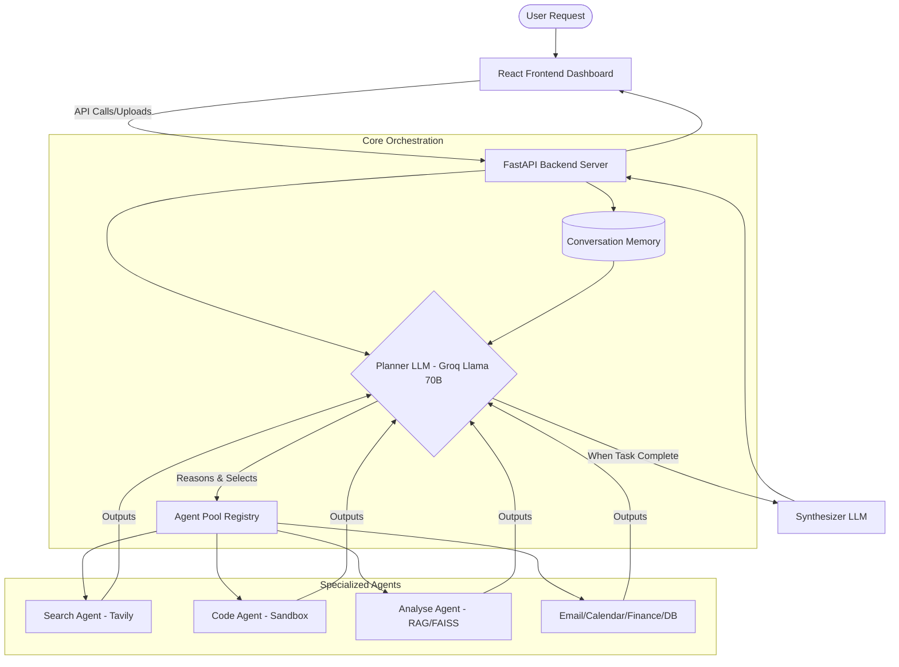
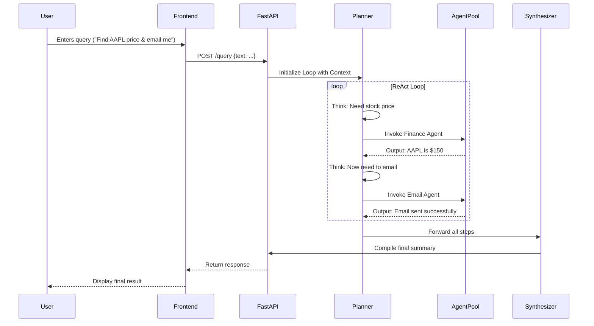
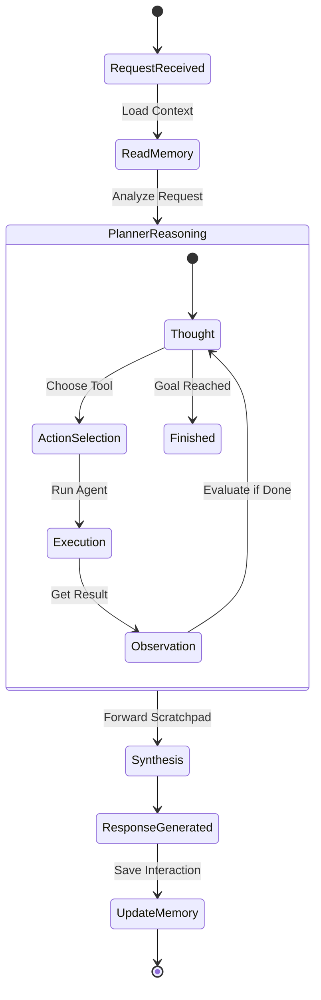

# JARVIS - Project Explanation & Architecture Plan

## 1. Executive Summary
**What is JARVIS?**
JARVIS is a highly modular, extensible, multi-agent AI operating system powered by LangChain and Groq. Unlike traditional orchestrators that run agents in parallel or execute static scripts, JARVIS uses a **sequential agentic loop (ReAct pattern)**. The central planner (LLM) reasons step-by-step, executing specialized agents sequentially and feeding their outputs forward to solve complex, multi-stage requests autonomously.

## 2. Core Concepts & Topics
- **Sequential Agentic Loop (ReAct Pattern):** The core reasoning pattern. The Planner LLM evaluates the user request, decides on the next action/tool to use, observes the tool's output, and loops until the task is complete.
- **Agent Sandbox Environment:** A secure execution environment (powered by E2B Code Interpreter) where the `Code Agent` can run Python code, perform file operations, and execute logic without affecting the host machine directly.
- **RAG (Retrieval-Augmented Generation):** Used by the `Analyse Agent`. It indexes local documents (PDFs, Word, etc.) into a Vector Database (FAISS/ChromaDB) using Sentence Transformers, allowing the system to query and retrieve context-aware information.
- **Multimodal Capabilities:** Integrating vision capabilities (Llama 4 Scout) to understand and analyze images uploaded by the user.

## 3. Technology Stack, Tools & APIs
### Backend
- **Framework:** FastAPI (High-performance REST API Server)
- **AI / Orchestration:** LangChain, LangChain-Groq, LangChain-Community
- **LLM Provider:** Groq (High-speed inference using models like Llama-3-70B)
- **Vector Database:** FAISS / ChromaDB (for local embeddings)
- **Embeddings:** Sentence-Transformers (HuggingFace)
- **Execution Sandbox:** e2b-code-interpreter
- **Document Parsing:** pypdf, docx2txt, python-pptx, pillow, pandas

### Frontend
- **Framework:** React + Vite
- **Styling:** CSS/Tailwind (Glassmorphism & Neon aesthetic for the dashboard)

### External APIs & Integrations
- **Web Search:** Tavily API
- **Email:** Gmail API (IMAP/SMTP)
- **Calendar:** Google Calendar API
- **Finance:** yfinance API
- **Maps:** Geopy, Folium

## 4. System Components & Files Overview

**`/backend/core/` (The Brain):**
- `orchestrator.py`: Controls the overarching sequential loop.
- `planner.py`: The reasoning engine; evaluates context and selects the appropriate agent.
- `synthesizer.py`: Compiles the final user-facing response from all agent outputs.
- `memory.py`: Manages conversation history and session context.
- `registry.py`: Manages the pool of available plug-and-play agents.
- `sandbox.py`: Manages the secure E2B code execution environment.
- `analytics.py`, `webhooks.py`, `notifications.py`: Support components for metrics and external triggers.

**`/backend/agents/` (The Tools):**
- `search_agent.py`: Real-time web search (Tavily).
- `code_agent.py`: Sandbox code execution and file operations.
- `analyse_agent.py`: Document RAG and image vision over local files.
- `summary_agent.py`: Text summarization and general writing.
- `email_agent.py`: Gmail inbox reading and sending.
- `database_agent.py`: SQLite operations using natural-language-to-SQL translation.
- `scraper_agent.py`: Webpage scraping (stripping HTML to clean text).
- `calendar_agent.py`: Google Calendar scheduler.
- `finance_agent.py`: Stock and crypto data retrieval.
- `maps_agent.py`: Geolocation and map generation.
- `visualization_agent.py`: Data plotting (Matplotlib/Seaborn).
- `image_gen_agent.py`: Image generation.
- `voice_agent.py`: Speech-to-text / Text-to-speech handling.
- `devops_agent.py` & `package_manager_agent.py`: System operations.
- `agent_builder_agent.py`: Meta-agent to dynamically build new agents.

**`/frontend/` (The Dashboard):**
- `src/App.jsx`: Main React application controller.
- `src/index.css`: UI styles (Glassmorphism, glowing/breathing neon effects).
- Contains components for visualizing agent execution (Registry cards) and drag-and-drop file uploads.

## 5. Architectural & System Design Diagrams

### 5.1 System Architecture Diagram
*(See generated images provided by Antigravity in your conversation artifacts for high-res visual version)*

**Mermaid Component Architecture:**

### 5.2 Data Flow Diagram
*(See generated images provided by Antigravity in your conversation artifacts for high-res visual version)*

**Mermaid Data Flow:**

### 5.3 System Design (ReAct Agentic Loop)
*(See generated images provided by Antigravity in your conversation artifacts for high-res visual version)*

**Mermaid State Diagram (ReAct Process):**

## 6. Interview Preparation Guide
When discussing this project in an interview, focus on these key talking points:

1. **The Problem it Solves:** Traditional AI chat tools are passive and one-dimensional. JARVIS acts as an autonomous operating system that can perform multi-step tasks across different domains (web, email, code, database) without human intervention.
2. **The "ReAct" Pattern:** Emphasize that the system *reasons* before acting. It doesn't just trigger APIs; it thinks about what information it needs, fetches it, evaluates the result, and decides the next step dynamically.
3. **Modularity & Scalability:** Explain how the `/backend/agents/` structure makes it infinitely scalable. Adding a new capability is as simple as dropping a new Python file into the agents folder and registering it in the Agent Pool.
4. **Security & Sandboxing:** Mention the use of E2B Code Interpreter for the `Code Agent` to execute Python code securely in an isolated environment, preventing system compromise.
5. **Context Awareness & Privacy:** Highlight the use of FAISS and local embeddings to give the agent memory and access to local documents without sending sensitive files over the internet to third-party LLMs (except when explicitly required).
