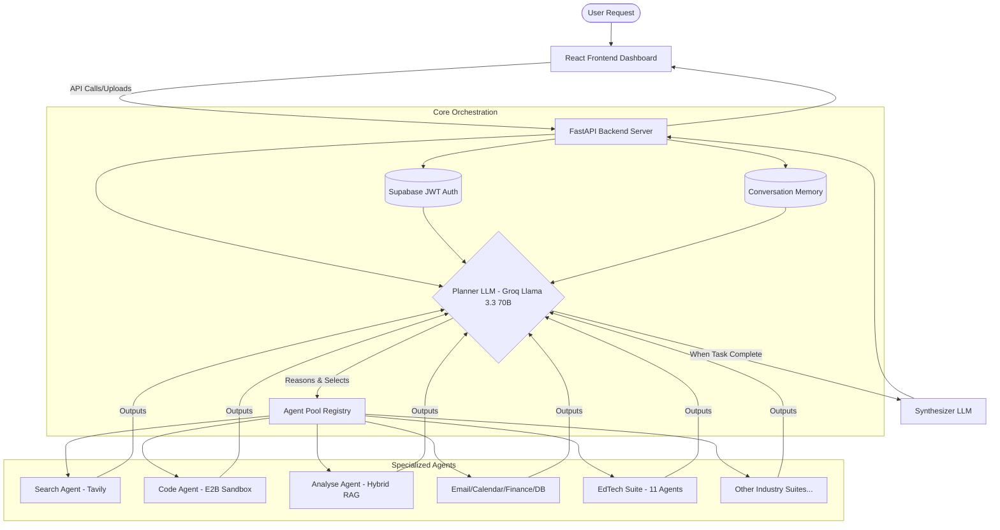
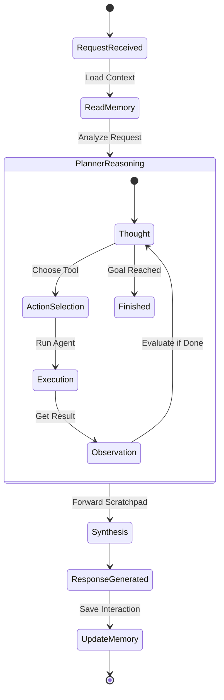

# 🤖 JARVIS — Autonomous AI Operating System

JARVIS is a production-grade, highly modular, and extensible multi-agent AI operating system powered by LangChain and Groq.

Unlike traditional orchestrators that run agents in static parallel paths or hardcoded sequences, JARVIS features a **sequential agentic loop (ReAct pattern)**. The central planner reasons step-by-step using a persistent reasoning scratchpad, dynamically selecting and executing specialized agents from a self-describing registry, and feeding their outputs forward to solve complex, multi-stage requests.

---

## 🏗️ System Architecture

```
                                 ┌────────────────────────┐
                                 │     React Frontend     │
                                 │  (Vite + Supabase Auth)│
                                 └───────────┬────────────┘
                                             │ (FastAPI REST & SSE)
                                             ▼
                                 ┌────────────────────────┐
                                 │     FastAPI Server     │
                                 │  (JWT Auth via Supabase)│
                                 └───────────┬────────────┘
                                             │
                                             ▼
                                 ┌──────────────────────────┐
                                 │ Conversation Memory      │
                                 └────────────┬─────────────┘
                                             │ (Context)
                                             ▼
                                 ┌──────────────────────────┐
                   ┌────────────►│  Planner LLM (Llama 3.3 70B) ├────────────┐
                   │             └────────────┬─────────────┘            │
                   │                          │                          │
             (Scratchpad)                     │ (Next Step Decision)     │
                   │                          ▼                          │
                   │             ┌──────────────────────────┐            │
                   └─────────────┤   Agent Pool Registry    │            │
                                 ├──────────────────────────┤            │
                                 │ 🔍 Search Agent          │            │
                                 │ 💻 Code Agent (Sandbox)  │            │
                                 │ 📊 Analyse Agent (RAG)   │            │
                                 │ 📝 Summary Agent         │            │
                                 │ 📧 Email Agent (Gmail)   │            │
                                 │ 🗄️ Database Agent (SQL)  │            │
                                 │ 🌐 Scraper Agent (HTML)  │            │
                                 │  ... [37+ Agents Across 7 Suites]    │
                                 └────────────┬─────────────┘            │
                                              │                          │
                                              ▼ (All Steps Complete)     │
                                 ┌──────────────────────────┐            │
                                 │    Synthesizer LLM       │◄───────────┘
                                 └────────────┬─────────────┘
                                              │
                                              ▼
                                 ┌──────────────────────────┐
                                 │   Final User Response    │
                                 └──────────────────────────┘
```

### Component Flow


### ReAct Agentic Loop


---

## ⚡ Key Features

* **Sequential Agentic Loop:** Solves complex queries step-by-step. If you ask to *"Search for the price of BTC, calculate buy power for $1000 in Python, create a chart, and email the output,"* the planner runs `search` ➔ `code` (sandbox calculation) ➔ `visualization` ➔ `email` sequentially.
* **Supabase Authentication:** Full JWT-based user authentication (sign-up/sign-in/sign-out) powered by Supabase. Every API request is user-scoped, ensuring complete data isolation between users.
* **Multi-User Workspace Isolation:** Per-user scoped documents, FAISS indexes, SQLite databases, and profile configurations. Zero data leakage between accounts.
* **Hierarchical Sub-Orchestrators & Teams:** Specialized team agents (Analyst, Dev, Ops) capable of managing their own sub-tasks and delegating to sub-agents for advanced, coordinated problem solving.
* **Dynamic Agent Configuration:** Fine-tune and customize individual agent behaviors, prompts, and parameters directly through the platform interface via `backend/config/agent_expertise.yaml`.
* **Self-Describing Agent Registry:** Drop-in extensibility. Add a new agent file and the `__init__.py` auto-discovers and registers it. The Planner LLM automatically discovers and utilizes it.
* **Self-Correction & Autonomy:** Active error-handling. Agents like `Code Agent` and `Database Agent` analyze execution logs, trace errors (e.g., syntax errors, SQL exceptions), and automatically self-heal and re-run commands before reporting back.
* **Containerized Sandbox:** Runs code in a secure execution sandbox (E2B Code Interpreter) with a local Docker daemon execution fallback for robust environment isolation.
* **Dedicated Workspaces & Multi-Domain Profiles:** Complete workspace segregation and 12 specialized industry roles (`cloud_devops`, `financial_analyst`, `cybersec_auditor`, `healthcare_researcher`, `creative_marketer`, `legal_ops`, `edtech_studio`, etc.). Dynamically loads curated agent suites tailored to specific business domains.
* **Google Workspace OAuth Integration:** Full OAuth2 flow for Google Drive, Google Docs, Google Sheets, and Google Calendar. EdTech agents can generate PDFs, auto-create live Google Docs, and schedule Calendar events using connected user accounts.
* **Hybrid RAG with BM25 + Reranking:** The Analyse Agent uses hybrid BM25 keyword + FAISS semantic search with Cohere reranking for production-grade retrieval accuracy.
* **Usage Analytics & Cost Tracking:** Live metrics monitoring. Real-time cost calculations and token tracking per model and agent step, streamable directly via Server-Sent Events (SSE).
* **Webhook I/O Channels:** Triggers external integrations. Register incoming event hooks and broadcast structured agent execution status updates via outgoing webhooks.
* **Aesthetic React Dashboard UI:**
  * **Agent Execution Visualizer:** Real-time glowing cards and active status indicators tracking active agents through the execution loop.
  * **Drag-and-Drop Indexer:** Instantly upload PDFs, Office docs, and text files to automatically index them in the FAISS vector database.
  * **Integrations Modal:** OAuth connection management for Google Workspace with live connection status indicators.
  * **Developer Panel:** Live analytics, webhook management, and agent performance diagnostics.
  * **Workspace Explorer:** Per-user file/workspace browser with session management.
  * **Agent Builder Panel:** UI for creating and registering custom agents directly from the dashboard.
  * **Teacher Studio Dashboard:** Dedicated EdTech management interface.

---

## 🔌 Agent Pool Registry (37+ Specialized Agents Across 7 Industry Suites)

JARVIS features a robust ecosystem of specialized agents categorized by capability:

### 1. Core Reasoning & File Systems
* **🔍 Search:** Real-time web search integration powered by Tavily API.
* **💻 Code:** Secure E2B sandbox file system operations (read/write/search) and code execution with self-correction.
* **📊 Analyse:** Hybrid RAG (BM25 + FAISS + Cohere Reranking) over local vector databases. Images are natively parsed using multimodal vision LLMs (**Llama 4 Scout**).
* **📝 Summary:** Contextual language tasks, copywriting, and general text summaries.

### 2. Services & APIs
* **📧 Email:** Read inbox summaries, fetch emails, and send messages via Gmail SMTP/IMAP.
* **📅 Calendar:** Google Calendar scheduling to search free slots, create meetings, and coordinate agendas.
* **🗄️ Database:** Natural-language-to-SQL translation running safe local SQLite database queries with schema self-healing.
* **🌐 Scraper:** Fetches clean page body text by stripping scripts, navigation, and style layouts.
* **🗺️ Maps:** Geolocation, routing calculations, and interactive Folium map configurations.

### 3. Extended & Media Capabilities
* **🎨 Image Gen:** Text-to-image synthesis.
* **💰 Finance:** Pull stock trends, historical charts, portfolio metrics, and cryptocurrency prices via `yfinance`.
* **🗣️ Voice:** Built-in Speech-to-Text (STT) and Text-to-Speech (TTS) integration.
* **🌍 Translation:** Dynamic localization supporting translation across multiple target languages.
* **🎥 Video to MP3:** Audio extraction and media formatting utilities.
* **📊 Visualization:** Renders structured data into high-quality Matplotlib/Seaborn charts, saved as static images.

### 4. Meta & Systems Control
* **🔧 DevOps:** Monitor running processes, docker builds, logs tailing, and GitHub workflow status.
* **📦 Package Manager:** Dynamic pip package installations inside sandbox environments.
* **🔔 Notification:** Dispatches Server-Sent Events (SSE) toast notifications to the client dashboard.
* **🤖 Agent Builder:** A meta-agent that writes, registers, and deploys *new* agents into the system dynamically.
* **👥 Team Sub-Orchestrators:** Specialized team leader agents (Analyst, Dev, Ops) that coordinate multiple sub-agents to solve complex domain-specific tasks.

### 5. Multi-Domain Industry Suites
* **☁️ Cloud DevOps Suite (`cloud_infra`, `github_workflow`):** Infrastructure-as-Code dry runs via Terraform, Kubernetes health inspections, pull request summaries, and issue triage automation.
* **📈 Finance & BI Suite (`market_intelligence`, `financial_reporting`):** Real-time stock fundamentals, crypto sentiment index analysis, executive P&L statement generation, and departmental expense auditing.
* **🛡️ Cybersecurity & Compliance Suite (`sec_ops`, `compliance`):** Dependency CVE vulnerability auditing, authentication log inspections, and compliance readiness verification (SOC2, GDPR, ISO27001).
* **🧬 Healthcare & Life Sciences Suite (`biomedical_rag`):** PubMed peer-reviewed research indexing, clinical trial synthesis, and medical literature extraction.
* **📣 Creative & Marketing Suite (`marketing_campaign`, `multimedia_processor`):** SEO campaign strategy generation, multi-platform ad headlines, video storyboard scripts, and media production outlines.
* **⚖️ Legal & HR Ops Suite (`legal_contract`, `talent_ops`):** Automated contract clause extraction, NDA risk rating, candidate resume skill parsing, and customized technical interview rubrics.

### 6. 🎓 EdTech Studio Suite (11 Agents)
A comprehensive autonomous executive assistant for K-12 schools, university educators, and corporate trainers. All agents feature **PDF export** and **live Google Docs/Sheets/Calendar integration**:

* **`ncert_lesson_architect`:** Exhaustive period-by-period timeline lesson plans and syllabus blueprints aligned to NCERT/CBSE curricula, with downloadable PDF export and live Google Doc creation.
* **`cbse_exam_generator`:** Generate structured question papers (MCQ, Short Answer, Long Answer) with answer keys, with PDF export.
* **`hinglish_socratic_tutor`:** Interactive Hinglish (Hindi-English) Socratic tutor — guides students step-by-step without revealing answers.
* **`cce_report_card_architect`:** Generate CCE-format student report cards with per-subject grades, remarks, and Google Sheets gradebook export.
* **`teacher_executive_assistant`:** AI executive assistant for educators — drafts lesson summaries, meeting agendas, and parent communication emails.
* **`document_exam_scanner`:** Scan and extract structured data from uploaded exam papers and worksheet PDFs using multimodal vision (Llama 4 Scout).
* **`sheets_gradebook_agent`:** Create and maintain live Google Sheets gradebooks with formula-based auto-grading.
* **`calendar_scheduler_agent`:** Intelligently schedule parent-teacher meetings, exam reminders, and academic milestones on Google Calendar.
* **`notes_manager_agent`:** Manage, organize, and search lecture notes, class observations, and revision material.
* **`whatsapp_notice_curator`:** Generate concise parent broadcast messages for WhatsApp/SMS notifications.
* **`cce_report_card_architect`:** Full NCERT/CBSE aligned CCE report card generator.

---

## 📁 Project Structure

```
JARVIS/
├── main.py                       # CLI Wrapper
├── requirements.txt              # Python Dependencies
├── README.md                     # Project Documentation
├── Project_Plan.md               # Architecture Specifications
├── new_profiles.md               # B2B Product Roadmap (5 new suites)
├── Future_Ideas.md               # Planned Enhancements
│
├── backend/                      # Python Server-Side Core
│   ├── main.py                   # Command-line entrypoint
│   ├── config.py                 # Central config (keys, models, multi-user paths, 12 role profiles)
│   ├── logger.py                 # Color-coded structured console logger
│   │
│   ├── config/
│   │   └── agent_expertise.yaml  # Per-agent domain expert system prompts (YAML-configurable)
│   │
│   ├── core/                     # Orchestrator & System Engines
│   │   ├── orchestrator.py       # Sequential planning loop controller
│   │   ├── planner.py            # Step-by-step agent routing logic
│   │   ├── synthesizer.py        # Compiles execution step history into final response
│   │   ├── memory.py             # User conversation history manager
│   │   ├── registry.py           # Self-describing agent registry + CustomAgentWrapper
│   │   ├── sandbox.py            # E2B Sandbox & Docker execution runner
│   │   ├── analytics.py          # LLM cost and token counters (LangChain callback)
│   │   ├── webhooks.py           # Incoming/outgoing event hooks
│   │   └── notifications.py      # Real-time Server-Sent Events controller
│   │
│   ├── agents/                   # Modular Agent Implementations (37+ agents, auto-discovered)
│   │   ├── base.py               # Abstract Base Agent class
│   │   ├── search_agent.py       # Tavily Web Search agent
│   │   ├── code_agent.py         # File operations & self-correcting interpreter
│   │   ├── analyse_agent.py      # Hybrid RAG (BM25+FAISS+Cohere Rerank) & Multimodal vision
│   │   ├── summary_agent.py      # Text summarization & copywriting
│   │   ├── email_agent.py        # Gmail IMAP/SMTP agent
│   │   ├── calendar_agent.py     # Google Calendar scheduler
│   │   ├── database_agent.py     # NL-to-SQL SQLite agent with schema self-healing
│   │   ├── scraper_agent.py      # HTML scraper & text extractor
│   │   ├── finance_agent.py      # yfinance stock/crypto data
│   │   ├── maps_agent.py         # Geopy & Folium geolocation/map agent
│   │   ├── visualization_agent.py# Matplotlib/Seaborn chart renderer
│   │   ├── image_gen_agent.py    # Text-to-image synthesis
│   │   ├── voice_agent.py        # STT/TTS agent
│   │   ├── translation_agent.py  # Multi-language translation
│   │   ├── video_to_mp3_agent.py # Audio extraction utility
│   │   ├── devops_agent.py       # System & Docker monitoring
│   │   ├── package_manager_agent.py # Dynamic pip installer
│   │   ├── notification_agent.py # SSE toast notifications
│   │   ├── agent_builder_agent.py# Meta-agent for dynamic agent creation
│   │   ├── cloud_infra_agent.py  # Cloud infrastructure & IaC agent
│   │   ├── github_workflow_agent.py # GitHub CI/CD & PR management
│   │   ├── sec_ops_agent.py      # CVE security audit & log analysis
│   │   ├── compliance_agent.py   # SOC2/GDPR/ISO27001 compliance checks
│   │   ├── market_intelligence_agent.py # Real-time market & crypto analysis
│   │   ├── financial_reporting_agent.py # P&L & expense report generation
│   │   ├── biomedical_rag_agent.py # PubMed research & clinical literature RAG
│   │   ├── marketing_campaign_agent.py  # SEO & multi-platform ad copy
│   │   ├── multimedia_processor_agent.py # Video storyboard & media production
│   │   ├── legal_contract_agent.py # Contract clause extraction & NDA risk rating
│   │   ├── talent_ops_agent.py   # Resume parsing & interview rubric generation
│   │   ├── edtech_agent.py       # 11-agent EdTech Studio (lessons, exams, tutoring, gradebooks)
│   │   ├── analyst_team_agent.py # Analyst sub-orchestrator team leader
│   │   ├── dev_team_agent.py     # Developer sub-orchestrator team leader
│   │   ├── ops_team_agent.py     # Ops sub-orchestrator team leader
│   │   └── team_base.py          # Shared base for team orchestrator agents
│   │
│   ├── tools/                    # Core Utilities
│   │   └── document_loader.py    # Multi-format document parser (PDF, DOCX, PPTX, images)
│   │
│   ├── utils/                    # Shared Service Clients
│   │   ├── pdf_generator.py      # ReportLab PDF export utility (EdTech)
│   │   ├── google_sheets_service.py   # Google Sheets API client (live gradebooks)
│   │   └── google_workspace_service.py # Google Drive/Docs/Calendar OAuth2 service
│   │
│   └── api/
│       └── server.py             # FastAPI router (Auth, Upload, Chat, Webhooks, SSE, Analytics)
│
├── data/                         # Runtime Data (auto-created, gitignored)
│   ├── documents/                # Per-user uploaded documents
│   ├── faiss_index/              # Per-user FAISS vector indexes
│   ├── workspace/                # Per-user code sandbox workspace
│   ├── generated_images/         # Agent-generated images (served via /images)
│   └── databases/                # Per-user SQLite DBs & profile JSON configs
│
├── tests/
│   └── test_self_correction.py   # Integration tests for self-correction loops
│
└── frontend/                     # React + Vite Client Dashboard
    ├── index.html
    ├── vite.config.js
    ├── package.json              # React 18, Supabase JS, Recharts
    └── src/
        ├── main.jsx              # React entry point
        ├── App.jsx               # Main app controller & SSE listener
        ├── supabaseClient.js     # Supabase client initialization
        ├── index.css             # Neon glassmorphism & breathing animation styles
        └── components/
            ├── Login.jsx         # Supabase auth UI + workspace profile selection
            ├── Header.jsx        # Top navigation bar
            ├── Sidebar.jsx       # Left-side navigation & session management
            ├── AgentsGrid.jsx    # Glowing agent registry cards & execution visualizer
            ├── ChatInput.jsx     # Chat bar with drag-and-drop file uploads
            ├── ChatMessage.jsx   # Markdown-rendered message bubbles
            ├── ArtifactsPanel.jsx# Generated artifacts viewer (images, PDFs, charts)
            ├── AgentBuilderPanel.jsx # Custom agent creation UI
            ├── DevPanel.jsx      # Analytics, webhooks & dev diagnostics
            ├── IntegrationsModal.jsx # Google Workspace & Slack OAuth management
            ├── WorkspaceExplorer.jsx # Per-user file browser
            ├── TeacherStudioDashboard.jsx # EdTech suite dedicated dashboard
            ├── ParticleBackground.jsx # Animated particle canvas background
            ├── TypingIndicator.jsx   # LLM streaming typing indicator
            └── teacher/          # EdTech teacher-specific sub-components
```

---

## 🛠️ Tech Stack & Requirements

### Core Frameworks

| Layer | Technology |
|---|---|
| **Backend** | FastAPI (Python 3.10+), Uvicorn |
| **AI Orchestration** | LangChain, LangChain-Core, LangChain-Community |
| **LLM Provider** | Groq (`llama-3.3-70b-versatile`, `meta-llama/llama-4-scout-17b-16e-instruct`) |
| **Vector DB** | FAISS (local per-user), ChromaDB |
| **Embeddings** | HuggingFace Sentence-Transformers (`all-MiniLM-L6-v2`) |
| **Hybrid Search** | BM25 (`rank_bm25`) + Cohere Reranking |
| **Frontend** | React 18, Vite 5, Vanilla CSS (Glassmorphism) |
| **Auth** | Supabase (JWT / OAuth2) |
| **Data Charts** | Recharts |

### APIs & Sandboxing

| Service | Purpose |
|---|---|
| **Groq** | Primary LLM inference (Planner, Synthesizer, all agents) |
| **Tavily** | Real-time web search |
| **E2B Code Interpreter** | Secure sandboxed Python execution |
| **Supabase** | User authentication & JWT verification |
| **Google OAuth2** | Drive, Docs, Sheets, Calendar integration |
| **Gmail IMAP/SMTP** | Email read/send |
| **yfinance** | Stock & cryptocurrency data |
| **Geopy + Folium** | Geocoding & interactive map rendering |
| **Cohere** | RAG document reranking |
| **Slack Webhooks** | Outgoing notifications |

---

## 🚀 Setup & Installation

### 1. Clone & Set Up Environment
```bash
git clone https://github.com/yourusername/JARVIS.git
cd JARVIS
```

Create a `.env` file in the root directory:
```env
# LLM
GROQ_API_KEY=your_groq_api_key

# Search
TAVILY_API_KEY=your_tavily_api_key

# Email
GMAIL_EMAIL=your_gmail_address
GMAIL_APP_PASSWORD=your_gmail_app_password

# Auth
SUPABASE_URL=your_supabase_project_url
SUPABASE_ANON_KEY=your_supabase_anon_key

# Sandbox
E2B_API_KEY=your_e2b_api_key

# Google Workspace OAuth2
GOOGLE_CLIENT_ID=your_google_client_id
GOOGLE_CLIENT_SECRET=your_google_client_secret

# Reranking (optional)
COHERE_API_KEY=your_cohere_api_key

# Notifications (optional)
SLACK_WEBHOOK_URL=your_slack_webhook_url
```

### 2. Install Backend Dependencies
It is recommended to run in a virtual environment:
```bash
python -m venv venv
# Windows:
venv\Scripts\activate
# macOS/Linux:
source venv/bin/activate

pip install -r requirements.txt
```

### 3. Install Frontend Dependencies
```bash
cd frontend
npm install
```

---

## 📡 Running Locally

### Start Backend Server (FastAPI)
From the root directory (with virtual environment active):
```bash
uvicorn backend.api.server:app --reload --port 8000
```

### Start Frontend Server (Vite)
From the `frontend/` directory:
```bash
npm run dev
```

Open [http://localhost:5173/](http://localhost:5173/) to interact with the dashboard.

---

## 🔐 Authentication Flow

JARVIS uses **Supabase** for full user authentication:

1. Users sign up/sign in via the `Login.jsx` component using email/password or OAuth.
2. A Supabase JWT is issued and sent with every API request as an `Authorization: Bearer <token>` header.
3. The FastAPI server verifies the token against the Supabase `/auth/v1/user` endpoint.
4. A `contextvars.ContextVar` (`current_user_id`) scopes all data operations (FAISS index, SQLite DB, document uploads, profile config) to the authenticated user.

---

## 🏢 Workspace Profiles

JARVIS supports **12 pre-configured workspace roles**, each loading a curated agent suite:

| Role | Key Agents |
|---|---|
| `developer` | `code`, `devops`, `package_manager`, `database`, `agent_builder`, `dev_team` |
| `analyst` | `analyse`, `visualization`, `finance`, `database`, `analyst_team` |
| `designer` | `image_gen`, `visualization`, `translation` |
| `manager` | `calendar`, `email`, `notification`, `ops_team` |
| `cloud_devops` | `cloud_infra`, `github_workflow`, `devops`, `code` |
| `financial_analyst` | `market_intelligence`, `financial_reporting`, `finance`, `analyse` |
| `cybersec_auditor` | `sec_ops`, `compliance`, `code`, `database` |
| `healthcare_researcher` | `biomedical_rag`, `analyse`, `translation` |
| `creative_marketer` | `marketing_campaign`, `multimedia_processor`, `image_gen` |
| `legal_ops` | `legal_contract`, `talent_ops`, `analyse` |
| `edtech_studio` | Full 11-agent EdTech Suite + `search`, `analyse`, `calendar`, `sheets` |
| `guest` | `search`, `summary`, `translation` |

---

## 🧪 Integration Testing & Self-Correction Verification

JARVIS includes a robust integration test suite to validate the self-correction loops and multi-agent coordination under sandboxed workspace and database constraints.

### Executing Tests
To run the integration test suite locally, set the `PYTHONPATH` to the project root and execute the test file:

```bash
# Windows (PowerShell):
$env:PYTHONPATH="."; python tests/test_self_correction.py

# macOS/Linux:
PYTHONPATH=. python tests/test_self_correction.py
```

### Covered Validation Scenarios
1. **Code Agent Self-Correction:** Validates that the `CodeAgent` recovers from runtime script errors (e.g. `NameError`) by interpreting the trace logs, amending the code, and re-executing successfully.
2. **Database Agent Self-Correction:** Validates that the `DatabaseAgent` handles query errors (e.g. missing tables) by automatically creating tables and repeating the transaction.
3. **Module Installation Loop (Orchestration):** Validates that if a script execution fails due to a missing package (`ModuleNotFoundError`), the Orchestrator routes the request to the `PackageManagerAgent` to install the dependency (via `pip`), then resumes execution successfully.
4. **Database Schema Evolution:** Validates that if an insert query fails due to a missing column, the `DatabaseAgent` runs an `ALTER TABLE` statement to evolve the schema, then completes the insertion.

---

## 📜 License

This project is licensed under the MIT License.
