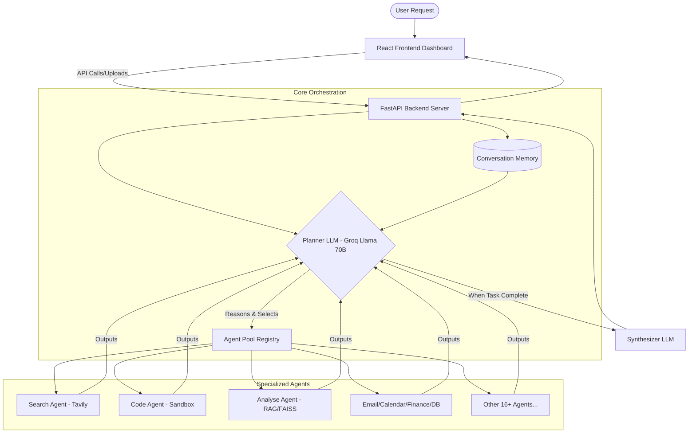
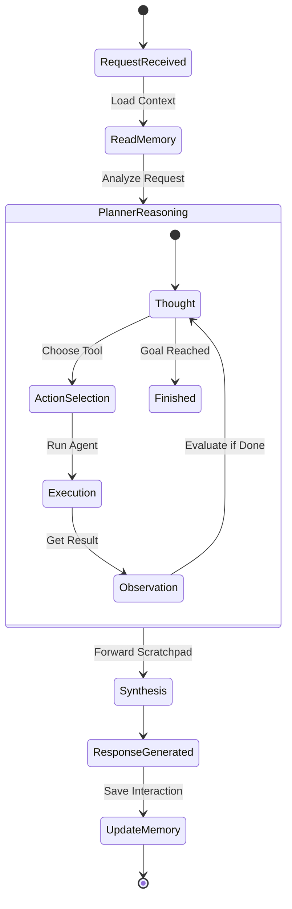

# 🤖 JARVIS — Autonomous AI Operating System

JARVIS is a production-grade, highly modular, and extensible multi-agent AI operating system powered by LangChain and Groq.

Unlike traditional orchestrators that run agents in static parallel paths or hardcoded sequences, JARVIS features a **sequential agentic loop (ReAct pattern)**. The central planner reasons step-by-step using a persistent reasoning scratchpad, dynamically selecting and executing specialized agents from a self-describing registry, and feeding their outputs forward to solve complex, multi-stage requests.

---

## 🏗️ System Architecture

```
                                 ┌────────────────────────┐
                                 │     React Frontend     │
                                 └───────────┬────────────┘
                                             │ (FastAPI REST & upload)
                                             ▼
                                 ┌────────────────────────┐
                                 │     FastAPI Server     │
                                 └───────────┬────────────┘
                                             │
                                             ▼
                                 ┌──────────────────────────┐
                                 │ Conversation Memory      │
                                 └────────────┬─────────────┘
                                             │ (Context)
                                             ▼
                                 ┌──────────────────────────┐
                   ┌────────────►│  Planner LLM (Llama 70B) ├────────────┐
                   │             └────────────┬─────────────┘            │
                   │                          │                          │
             (Scratchpad)                     │ (Next Step Decision)     │
                   │                          ▼                          │
                   │             ┌──────────────────────────┐            │
                   └─────────────┤   Agent Pool Registry    │            │
                                 ├──────────────────────────┤            │
                                 │ 🔍 Search Agent          │            │
                                 │ 💻 Code Agent (Sandbox)  │            │
                                 │ 📊 Analyse Agent (RAG)   │            │
                                 │ 📝 Summary Agent         │            │
                                 │ 📧 Email Agent (Gmail)   │            │
                                 │ 🗄️ Database Agent (SQL)  │            │
                                 │ 🌐 Scraper Agent (HTML)  │            │
                                 │  ... [20+ Agents Registered]          │
                                 └────────────┬─────────────┘            │
                                              │                          │
                                              ▼ (All Steps Complete)     │
                                 ┌──────────────────────────┐            │
                                 │    Synthesizer LLM       │◄───────────┘
                                 └────────────┬─────────────┘
                                              │
                                              ▼
                                 ┌──────────────────────────┐
                                 │   Final User Response    │
                                 └──────────────────────────┘
```

### Component Flow


### ReAct Agentic Loop


---

## ⚡ Key Features

* **Sequential Agentic Loop:** Solves complex queries step-by-step. If you ask to *"Search for the price of BTC, calculate buy power for $1000 in Python, create a chart, and email the output,"* the planner runs `search` ➔ `code` (sandbox calculation) ➔ `visualization` ➔ `email` sequentially.
* **Self-Describing Agent Registry:** Drop-in extensibility. Add a new agent file, register it in `registry.py` with a brief description, and the Planner LLM automatically discovers and utilizes it.
* **Self-Correction & Autonomy:** Active error-handling. Agents like `Code Agent` and `Database Agent` analyze execution logs, trace errors (e.g., syntax errors, SQL exceptions), and automatically self-heal and re-run their commands before reporting back.
* **Containerized Sandbox:** Runs code in a secure execution sandbox (E2B Code Interpreter) with a local Docker daemon execution fallback for robust environment isolation.
* **Multi-User Auth & RBAC:** Complete workspace segregation. Integrates token validation (Supabase) to isolate data storage, system configurations, analytics, and session history per active user.
* **Usage Analytics & Cost Tracking:** Live metrics monitoring. Real-time cost calculations and token tracking per model and agent step, streamable directly via Server-Sent Events (SSE).
* **Webhook I/O Channels:** Triggers external integrations. Register incoming event hooks and broadcast structured agent execution status updates via outgoing webhooks.
* **Aesthetic React Dashboard UI:**
  * **Agent Execution Visualizer:** Real-time glowing cards and active status indicators tracking active agents through the execution loop.
  * **Drag-and-Drop Indexer:** Instantly upload PDFs, Office docs, and text files to automatically index them in the FAISS vector database.

---

## 🔌 Agent Pool Registry (20+ Specialized Agents)

JARVIS features a robust ecosystem of specialized agents categorized by capability:

### 1. Core Reasoning & File Systems
* **🔍 Search:** Real-time web search integration powered by Tavily API.
* **💻 Code:** Secure sandbox file system operations (read/write/search) and code execution.
* **📊 Analyse:** Document RAG over local vector databases (FAISS/ChromaDB). Images are natively parsed using multimodal vision LLMs (**Llama 4 Scout**).
* **📝 Summary:** Contextual language tasks, copywriting, and general text summaries.

### 2. Services & APIs
* **📧 Email:** Read inbox summaries, fetch emails, and send messages via Gmail SMTP/IMAP.
* **📅 Calendar:** Google Calendar scheduling to search free slots, create meetings, and coordinate agendas.
* **🗄️ Database:** Natural-language-to-SQL translation running safe local SQLite database (`jarvis.db`) queries.
* **🌐 Scraper:** Fetches clean page body text by stripping scripts, navigation, and style layouts.
* **🗺️ Maps:** Geolocation, routing calculations, and interactive map configurations.

### 3. Extended Capabilities
* **🎨 Image Gen:** Text-to-image synthesis using DALL·E/Replicate models.
* **💰 Finance:** Pull stock trends, historical charts, portfolio metrics, and cryptocurrency prices.
* **🗣️ Voice:** Built-in Speech-to-Text (STT) and Text-to-Speech (TTS) integration.
* **🌍 Translation:** Dynamic localization supporting translation across multiple target languages.
* **🎥 Video to MP3:** Audio extraction and media formatting utilities.
* **📊 Visualization:** Renders structured data into high-quality Matplotlib/Pandas charts.

### 4. Meta & Systems Control
* **🔧 DevOps:** Monitor running processes, docker builds, logs tailing, and GitHub workflow status.
* **📦 Package Manager:** Dynamic pip package installations inside sandbox environments.
* **🔔 Notification:** Dispatches Server-Sent Events (SSE) toast notifications to the client dashboard.
* **🤖 Agent Builder:** A meta-agent that writes, registers, and deploys *new* agents into the system dynamically.

---

## 📁 Project Structure

```
JARVIS/
├── main.py                       # CLI Wrapper
├── requirements.txt              # Python Dependencies
├── README.md                     # Project Documentation
├── Project_Plan.md               # Architecture Specifications
│
├── backend/                      # Python Server-Side Core
│   ├── main.py                   # Command-line entrypoint
│   ├── config.py                 # Central configuration (keys, models, paths)
│   ├── logger.py                 # Color-coded structured console logger
│   │
│   ├── core/                     # Orchestrator & System Engines
│   │   ├── orchestrator.py       # Sequential planning loop controller
│   │   ├── planner.py            # Step-by-step agent routing logic
│   │   ├── synthesizer.py        # Compiles execution step history into final response
│   │   ├── memory.py             # User conversation history manager
│   │   ├── registry.py           # Self-describing agent registry loader
│   │   ├── sandbox.py            # E2B Sandbox & Docker execution runner
│   │   ├── analytics.py          # LLM cost and token counters
│   │   ├── webhooks.py           # Incoming/outgoing event hooks
│   │   └── notifications.py      # Real-time Server-Sent Events controller
│   │
│   ├── agents/                   # Modular Agent Implementations
│   │   ├── base.py               # Abstract Base Agent class
│   │   ├── search_agent.py       # Tavily Web Search agent
│   │   ├── code_agent.py         # File operations & self-correcting interpreter
│   │   ├── analyse_agent.py      # Vector DB RAG & Multimodal vision agent
│   │   ├── ...                   # (20+ specialized agents detailed above)
│   │   └── agent_builder_agent.py# Meta-agent for dynamic agent creation
│   │
│   ├── tools/                    # Core Utilities
│   │   └── document_loader.py    # Multi-format document parser
│   │
│   └── api/                      # REST API Layer
│       └── server.py             # FastAPI router (Auth, Upload, Chat, Webhooks, SSE)
│
└── frontend/                     # React + Vite Client Dashboard
    ├── src/
    │   ├── App.jsx               # Main React Application & SSE listener
    │   ├── index.css             # Neon, glassmorphism, and breathing styles
    │   └── components/           # Subsystem Dashboard components
    │       ├── AgentPanel.jsx    # Glowing Registry Cards & Visualizer
    │       └── ChatInput.jsx     # Chat bar with Drag-and-Drop file uploads
    └── vite.config.js
```

---

## 🛠️ Tech Stack & Requirements

### Core Frameworks
* **Backend:** FastAPI (Python 3.10+)
* **AI Orchestration:** LangChain / LangChain-Community
* **Models:** Groq (Llama-3-70B, Llama-4-Scout)
* **Vector DB:** FAISS & ChromaDB
* **Embeddings:** HuggingFace Sentence-Transformers
* **Frontend:** React, Vite, TailwindCSS (Vanilla CSS fallback modules)

### APIs & Sandboxing
* **Web Search:** Tavily API
* **Sandboxed Runtime:** E2B Code Interpreter / Local Docker Engine
* **Integrations:** Google Workspace (Gmail IMAP/SMTP, Google Calendar), Yahoo Finance, Geopy

---

## 🚀 Setup & Installation

### 1. Clone & Set Up Environment
```bash
git clone https://github.com/yourusername/JARVIS.git
cd JARVIS
```

Create a `.env` file in the root directory:
```env
GROQ_API_KEY=your_groq_api_key
TAVILY_API_KEY=your_tavily_api_key
GMAIL_EMAIL=your_gmail_address
GMAIL_APP_PASSWORD=your_gmail_app_password
SUPABASE_URL=your_supabase_project_url
SUPABASE_ANON_KEY=your_supabase_anon_key
```

### 2. Install Backend Dependencies
It is recommended to run in a virtual environment:
```bash
python -m venv venv
# Windows:
venv\Scripts\activate
# macOS/Linux:
source venv/bin/activate

pip install -r requirements.txt
```

### 3. Install Frontend Dependencies
```bash
cd frontend
npm install
```

---

## 📡 Running Locally

### Start Backend Server (FastAPI)
From the root directory (with virtual environment active):
```bash
uvicorn backend.api.server:app --reload --port 8000
```

### Start Frontend Server (Vite)
From the `frontend/` directory:
```bash
npm run dev
```

Open [http://localhost:5173/](http://localhost:5173/) to interact with the dashboard.

---

## 📜 License

This project is licensed under the MIT License.
