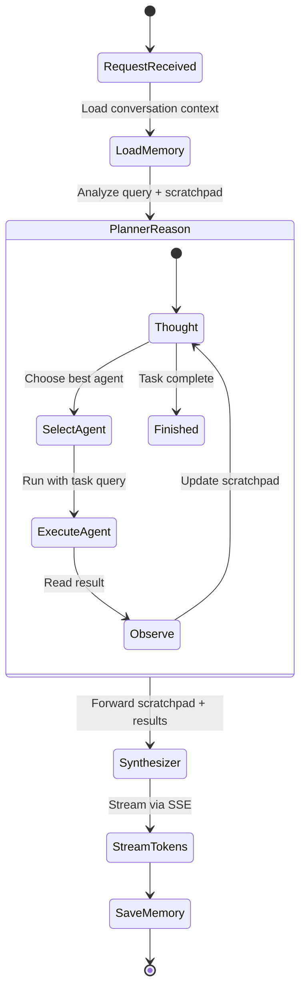

# 🤖 JARVIS — Autonomous Multi-Agent AI Operating System

<div align="center">

**Production-grade, multi-user AI platform powered by LangChain · HuggingFace · FastAPI · React**

[](https://python.org)
[](https://fastapi.tiangolo.com)
[](https://react.dev)
[](https://langchain.com)
[](https://huggingface.co)
[](LICENSE)

</div>

---

JARVIS is a **production-grade autonomous AI system** that orchestrates 37+ specialized agents to handle complex, multi-step tasks across 12 industry domains — from live code execution in a cloud sandbox to RAG-powered document analysis, Gmail automation, financial intelligence, and EdTech lesson planning. Powered entirely by **HuggingFace Inference API** — 8 specialized state-of-the-art models covering every AI task in the system.

Unlike simple chatbot wrappers, JARVIS implements a **real ReAct agentic loop**: the Planner LLM reasons step-by-step, selects the most relevant agent from a self-describing registry, feeds its output forward as context, and repeats until the task is fully complete — then streams the final answer token-by-token to the user.

---

## ✨ What Makes This Different

| Feature | Details |
|---|---|
| **Real Agentic Loop** | Not a RAG wrapper. The Planner reasons, acts, observes, and re-plans iteratively using a persistent scratchpad (ReAct pattern) |
| **Streaming Responses** | `/api/query/stream` SSE endpoint streams `step_start → agent_result → synthesis_chunk` events. The UI renders tokens as they arrive — identical to ChatGPT |
| **8 Specialized HF Models** | Qwen3-32B (planner), Qwen3-Coder-480B (code), Qwen2.5-VL-72B (vision), bge-m3 (embeddings), bge-reranker (RAG), Whisper-v3 (STT), Kokoro-82M (TTS), FLUX.1-dev (images) |
| **Multi-Tier Code Sandbox** | Code runs in E2B Cloud → Local Docker → Host subprocess, auto-detected at runtime with graceful degradation |
| **37+ Specialized Agents** | Search, Code, RAG, Email, Calendar, SQL, Finance, Maps, EdTech, DevOps, SecOps, Legal, Healthcare, and more |
| **12 Industry Profiles** | Per-profile agent configurations load curated tool suites for developers, analysts, teachers, security engineers, etc. |
| **Multi-User Isolation** | Per-user FAISS indexes, SQLite databases, document stores, and profile configs via `contextvars` |
| **Self-Correcting Agents** | Code Agent and Database Agent detect errors (syntax errors, SQL exceptions, missing modules), self-heal, and retry |
| **Dynamic Agent Builder** | Meta-agent that writes, validates, and hot-registers new Python agents into the running system at runtime |
| **Google Workspace OAuth** | Full OAuth2 flow for Drive, Docs, Sheets, and Calendar — live gradebook creation, calendar scheduling, PDF export |
| **Hybrid RAG** | BM25 keyword + FAISS semantic search + BAAI/bge-reranker-v2-m3 reranking — multilingual, production-grade retrieval accuracy |

---

## 🏗️ System Architecture

```
┌──────────────────────────────────────────────┐
│         React 18 Frontend (Vite)             │
│  Token streaming · Agent cards · OAuth UI    │
└──────────────────┬───────────────────────────┘
                   │  POST /api/query/stream  (SSE)
                   │  POST /api/query         (REST)
                   ▼
┌──────────────────────────────────────────────┐
│         FastAPI Server (Uvicorn)             │
│  JWT Auth (Supabase) · File Upload · SSE     │
└──────────────────┬───────────────────────────┘
                   │
         ┌─────────┴─────────┐
         │                   │
         ▼                   ▼
┌──────────────┐   ┌─────────────────────┐
│ Conversation │   │    Orchestrator      │
│   Memory     │──►│  (ReAct Loop ×5)    │
└──────────────┘   └────────┬────────────┘
                            │
             ┌──────────────▼────────────────┐
             │         Planner LLM           │
             │  (Qwen3-32B-Instruct · HF)    │
             │  Selects next agent + query   │
             └──────────────┬────────────────┘
                            │
             ┌──────────────▼────────────────────────────┐
             │          Agent Registry (37+ agents)       │
             │  🔍 Search · 💻 Code · 📊 RAG · 📧 Email  │
             │  🗄️ SQL · 💰 Finance · ☁️ DevOps · 🛡️ Sec │
             │  🎓 EdTech Suite (11 agents) · + more...   │
             └──────────────┬────────────────────────────┘
                            │
             ┌──────────────▼────────────────┐
             │       Synthesizer LLM         │
             │  Merges all agent outputs     │
             │  Streams tokens → SSE → UI    │
             └───────────────────────────────┘
```

### Streaming Event Flow (SSE)

```
POST /api/query/stream
        │
        ├── {"type": "step_start",      "agent": "search", "thought": "..."}
        ├── {"type": "agent_result",    "agent": "search", "result": "..."}
        ├── {"type": "step_start",      "agent": "code",   "thought": "..."}
        ├── {"type": "agent_result",    "agent": "code",   "result": "..."}
        ├── {"type": "synthesis_chunk", "chunk": "The "}
        ├── {"type": "synthesis_chunk", "chunk": "latest "}
        ├── {"type": "synthesis_chunk", "chunk": "AI news..."}
        ├── {"type": "done",            "agents_used": ["search", "code"]}
        └── {"type": "stream_end"}
```

### Multi-Tier Code Sandbox

```
E2B_API_KEY present?
      ✅ → Tier 1: E2B Cloud Sandbox   (isolated, remote VM, Python 3.13)
      ❌ → Docker daemon running?
               ✅ → Tier 2: Docker Container  (jarvis-sandbox image, local)
               ❌ → Tier 3: Host Subprocess  (fallback, warns user)
```

---

## ⚡ Key Features

### Core Engine
- **Sequential Agentic Loop (ReAct):** The Planner LLM iteratively reasons, selects agents, and re-plans using a persistent scratchpad — up to 5 steps per query
- **Real-Time SSE Streaming:** `/api/query/stream` pushes planning steps, agent results, and synthesis tokens as they happen. Frontend renders a live blinking cursor and step-pill badges
- **Conversation Memory:** Full multi-turn conversation history injected into every planner and agent call for context continuity
- **Self-Correction:** Code Agent detects `SyntaxError`, `NameError`, `ModuleNotFoundError` and self-heals. Database Agent handles missing tables / columns via `ALTER TABLE`
- **Agentic Checkpointing & Time-Travel Replay:** Automatically captures execution steps, conversation memory, and workspace file snapshots at each step of the orchestrator. Supports `resume_step` to allow rewinding and replaying failed flows.
- **Langfuse Tracing Integration:** Native tracing instrumentation via Langfuse callback handler to monitor LLM invocations, agent steps, latencies, and token consumption with graceful offline fallback.

### Security & Isolation
- **Multi-Tier Sandbox:** E2B Cloud → Docker Container → Host subprocess fallback, auto-detected at startup
- **AST SQL Firewall:** Advanced SQL parser firewall utilizing `sqlglot` to validate SQLite queries in real time. Blocks destructive DDL actions (`DROP`, `ALTER`) and access to sensitive metadata/system tables (e.g. `sqlite_master`, `conversations`).
- **Per-User Data Isolation:** Every user gets isolated FAISS indexes, SQLite databases, file storage, and profile configs via `contextvars.ContextVar`
- **JWT Authentication:** Supabase JWT verified on every request. No shared state between users

### Integrations
- **Model Context Protocol (MCP):** Stdio-compliant FastMCP server (`backend/mcp_server.py`) exposing specialized agent capabilities (`query_jarvis`, `run_db_query`, `search_web`) to external MCP client IDEs and agents.
- **Google Workspace OAuth2:** Drive, Docs, Sheets, Calendar — agents create live documents and schedule events in users' accounts
- **Gmail IMAP/SMTP:** Read inbox, fetch threads, and send emails programmatically
- **Tavily Web Search:** Real-time web search with structured results
- **yfinance:** Stock prices, historical charts, earnings data, cryptocurrency
- **Geopy + Folium:** Geolocation and interactive map rendering

### Extensibility
- **Self-Describing Registry:** Drop an agent file into `backend/agents/`, and the `__init__.py` auto-discovers and registers it. The Planner LLM immediately has access to it
- **Dynamic Agent Builder:** A meta-agent that writes, validates, imports, and hot-registers new Python agents at runtime — no restart required
- **YAML-Configurable Prompts:** Per-agent system prompts and domain expertise configurable in `backend/config/agent_expertise.yaml`
- **Webhook I/O:** Register incoming event hooks and broadcast agent execution updates via outgoing webhooks

---

## 🔌 Agent Registry (37+ Agents, 7 Industry Suites)

### Core Reasoning & File Systems
| Agent | Description |
|---|---|
| `search` | Real-time web search via Tavily API |
| `code` | Sandboxed 30+ language execution (E2B→Docker→Host). Primary: **Qwen3-Coder-480B-A35B** · Fallback: Vibe-Coding-Claude-Fable-5 |
| `analyse` | Hybrid RAG: BM25 + FAISS + **bge-reranker-v2-m3** reranking; multimodal OCR via **Qwen2.5-VL-72B** |
| `summary` | Copywriting, contextual summarization — powered by **Qwen3-32B-Instruct** |

### Services & APIs
| Agent | Description |
|---|---|
| `email` | Gmail IMAP/SMTP — read threads, send messages |
| `calendar` | Google Calendar — create events, find free slots |
| `database` | NL-to-SQL → SQLite with schema self-healing |
| `scraper` | Clean HTML extraction, removing scripts/nav/styles |
| `maps` | Geolocation, routing, Folium interactive maps |

### Media & Extended Capabilities
| Agent | Description |
|---|---|
| `image_gen` | Text-to-image synthesis via **FLUX.1-dev** (HuggingFace) · Pollinations fallback |
| `finance` | Stock/crypto data, charts, portfolio metrics via yfinance |
| `voice` | STT via **Whisper-large-v3** · TTS via **Kokoro-82M** (10 voices, HuggingFace) |
| `translation` | Multi-language translation via Qwen3-32B |
| `video_to_mp3` | Audio extraction from video files |
| `visualization` | Matplotlib/Seaborn chart renderer, saved as images |

### Meta & Systems Control
| Agent | Description |
|---|---|
| `devops` | Process monitoring, Docker status, GitHub workflow audits |
| `package_manager` | Pip/npm installs inside the multi-tier sandbox |
| `notification` | Push SSE toast notifications to the client dashboard |
| `agent_builder` | Writes and hot-registers new Python agents at runtime |
| `analyst_team` | Sub-orchestrator that coordinates Analyst, Finance, and Visualizer agents |
| `dev_team` | Sub-orchestrator for Code + DevOps + Package Manager coordination |
| `ops_team` | Sub-orchestrator for Calendar + Email + Notification coordination |

### ☁️ Cloud & DevOps Suite
| Agent | Description |
|---|---|
| `cloud_infra` | Terraform IaC dry-runs, Kubernetes pod health, AWS cost auditing |
| `github_workflow` | PR summaries, CI/CD pipeline audits, issue triage |

### 📈 Finance & BI Suite
| Agent | Description |
|---|---|
| `market_intelligence` | Real-time fundamentals, crypto sentiment, trend analysis |
| `financial_reporting` | P&L statement generation, departmental expense auditing |

### 🛡️ Cybersecurity Suite
| Agent | Description |
|---|---|
| `sec_ops` | CVE dependency auditing, auth log inspection |
| `compliance` | SOC2, GDPR, ISO27001 compliance readiness checks |

### 🧬 Healthcare Suite
| Agent | Description |
|---|---|
| `biomedical_rag` | PubMed research indexing, clinical trial synthesis |

### 📣 Creative & Marketing Suite
| Agent | Description |
|---|---|
| `marketing_campaign` | SEO strategy, multi-platform ad copy, email sequences |
| `multimedia_processor` | Video storyboard scripts, media production outlines |

### ⚖️ Legal & HR Suite
| Agent | Description |
|---|---|
| `legal_contract` | Contract clause extraction, NDA risk rating |
| `talent_ops` | Resume skill parsing, technical interview rubrics |

### 🎓 EdTech Studio (11 Agents)
Full autonomous executive assistant for K-12 and university educators, with PDF export and live Google Workspace integration:

| Agent | Description |
|---|---|
| `ncert_lesson_architect` | NCERT/CBSE lesson plans → PDF + live Google Doc |
| `cbse_exam_generator` | Question papers with answer keys → PDF export |
| `hinglish_socratic_tutor` | Hinglish Socratic tutoring (step-by-step guidance) |
| `cce_report_card_architect` | CCE-format student report cards → Google Sheets |
| `teacher_executive_assistant` | Lesson summaries, parent emails, meeting agendas |
| `document_exam_scanner` | Multimodal OCR of uploaded exam PDFs (Llama 4 Scout) |
| `sheets_gradebook_agent` | Live Google Sheets gradebooks with auto-grading formulas |
| `calendar_scheduler_agent` | Academic milestones and PTM scheduling on Google Calendar |
| `notes_manager_agent` | Organize and search lecture notes and revision material |
| `whatsapp_notice_curator` | Parent broadcast messages for WhatsApp/SMS |

---

## 📁 Project Structure

```
JARVIS/
├── main.py                           # ASGI entrypoint (uvicorn main:app)
├── requirements.txt
├── .env                              # API keys (not committed)
│
├── backend/
│   ├── config.py                     # Central config: models, paths, 12 role profiles
│   ├── logger.py                     # Color-coded structured logger
│   │
│   ├── config/
│   │   └── agent_expertise.yaml      # Per-agent domain prompts (YAML-configurable)
│   │
│   ├── core/
│   │   ├── orchestrator.py           # ReAct loop controller (plan → execute → synthesize)
│   │   ├── planner.py                # LLM-based next-step routing
│   │   ├── synthesizer.py            # Merges agent outputs → final response (streaming)
│   │   ├── memory.py                 # Per-session conversation history
│   │   ├── registry.py               # Auto-discovering agent registry
│   │   ├── sandbox.py                # Multi-tier sandbox: E2B → Docker → Host
│   │   ├── analytics.py              # Token + cost tracking (LangChain callback)
│   │   ├── webhooks.py               # Incoming/outgoing event hooks
│   │   └── notifications.py          # SSE notification broadcaster
│   │
│   ├── agents/                       # 37+ modular agents (auto-registered)
│   │   ├── base.py
│   │   ├── search_agent.py
│   │   ├── code_agent.py             # E2B/Docker/Host sandbox execution
│   │   ├── analyse_agent.py          # Hybrid RAG + multimodal vision
│   │   ├── summary_agent.py
│   │   ├── email_agent.py
│   │   ├── calendar_agent.py
│   │   ├── database_agent.py
│   │   ├── scraper_agent.py
│   │   ├── finance_agent.py
│   │   ├── maps_agent.py
│   │   ├── visualization_agent.py
│   │   ├── image_gen_agent.py
│   │   ├── voice_agent.py
│   │   ├── translation_agent.py
│   │   ├── video_to_mp3_agent.py
│   │   ├── devops_agent.py
│   │   ├── package_manager_agent.py
│   │   ├── notification_agent.py
│   │   ├── agent_builder_agent.py
│   │   ├── cloud_infra_agent.py
│   │   ├── github_workflow_agent.py
│   │   ├── sec_ops_agent.py
│   │   ├── compliance_agent.py
│   │   ├── market_intelligence_agent.py
│   │   ├── financial_reporting_agent.py
│   │   ├── biomedical_rag_agent.py
│   │   ├── marketing_campaign_agent.py
│   │   ├── multimedia_processor_agent.py
│   │   ├── legal_contract_agent.py
│   │   ├── talent_ops_agent.py
│   │   ├── edtech_agent.py           # 11-agent EdTech suite
│   │   ├── analyst_team_agent.py
│   │   ├── dev_team_agent.py
│   │   ├── ops_team_agent.py
│   │   └── team_base.py
│   │
│   ├── tools/
│   │   └── document_loader.py        # PDF, DOCX, PPTX, image parser
│   │
│   ├── utils/
│   │   ├── pdf_generator.py
│   │   ├── google_sheets_service.py
│   │   └── google_workspace_service.py
│   │
│   └── api/
│       └── server.py                 # FastAPI: Auth, Upload, /api/query, /api/query/stream
│
├── data/                             # Runtime data (gitignored)
│   ├── documents/                    # Per-user uploaded files
│   ├── faiss_index/                  # Per-user vector indexes
│   ├── workspace/                    # Per-user sandbox workspace
│   ├── generated_images/
│   └── databases/                    # Per-user SQLite + profile configs
│
├── tests/
│   └── test_self_correction.py
│
└── frontend/
    ├── vite.config.js
    ├── package.json
    └── src/
        ├── App.jsx                   # SSE stream consumer, state management
        ├── index.css                 # Neon glassmorphism, streaming animations
        └── components/
            ├── Login.jsx             # Auth + 12-profile workspace selector
            ├── Header.jsx
            ├── Sidebar.jsx
            ├── ChatMessage.jsx       # Streaming cursor + step-pill badges
            ├── ChatInput.jsx
            ├── AgentsGrid.jsx
            ├── ArtifactsPanel.jsx
            ├── AgentBuilderPanel.jsx
            ├── DevPanel.jsx
            ├── IntegrationsModal.jsx
            ├── WorkspaceExplorer.jsx
            ├── TeacherStudioDashboard.jsx
            ├── ParticleBackground.jsx
            └── TypingIndicator.jsx
```

---

## 🛠️ Tech Stack

### Backend
| Layer | Technology |
|---|---|
| **Framework** | FastAPI (Python 3.10+), Uvicorn ASGI |
| **AI Orchestration** | LangChain 0.3+, LangChain-Core, LangChain-Community, LangChain-OpenAI |
| **Planner / Chat LLM** | HuggingFace → `Qwen/Qwen3-32B-Instruct` (fallback: Groq llama-3.3-70b) |
| **Coding LLM** | HuggingFace → `Qwen/Qwen3-Coder-480B-A35B-Instruct` (fallback: Vibe-Coding-Claude-Fable-5) |
| **Vision / OCR LLM** | HuggingFace → `Qwen/Qwen2.5-VL-72B-Instruct` |
| **Embeddings** | HuggingFace → `BAAI/bge-m3` (multilingual, via Inference API) |
| **Reranking** | HuggingFace → `BAAI/bge-reranker-v2-m3` (fallback: Cohere) |
| **Speech-to-Text** | HuggingFace → `openai/whisper-large-v3` |
| **Text-to-Speech** | HuggingFace → `hexgrad/Kokoro-82M` (10 voices) |
| **Image Generation** | HuggingFace → `black-forest-labs/FLUX.1-dev` (fallback: Pollinations.ai) |
| **Vector DB** | FAISS (local per-user) |
| **Hybrid Search** | BM25 (`rank_bm25`) + bge-m3 embeddings + bge-reranker reranking |
| **Code Sandbox** | E2B Code Interpreter → Docker → Host subprocess |
| **Auth** | Supabase JWT verification |
| **Streaming** | Server-Sent Events (SSE) via `StreamingResponse` |

### Frontend
| Layer | Technology |
|---|---|
| **Framework** | React 18, Vite 5 |
| **Styling** | Vanilla CSS (glassmorphism, neon, streaming animations) |
| **Charts** | Recharts |
| **Auth** | Supabase JS client |
| **Streaming** | `ReadableStream` + `TextDecoder` SSE consumer |

### External APIs
| Service | Purpose |
|---|---|
| **HuggingFace Inference API** | Primary AI provider for all 8 model roles (chat, code, vision, embed, rerank, STT, TTS, image) |
| **Groq** | LLM fallback when `HUGGINGFACE_API_TOKEN` is not set |
| **Tavily** | Real-time web search |
| **E2B Code Interpreter** | Remote cloud sandbox for Python execution |
| **Supabase** | User authentication and JWT verification |
| **Google OAuth2** | Drive, Docs, Sheets, Calendar integration |
| **Gmail IMAP/SMTP** | Email read/send |
| **yfinance** | Stock and cryptocurrency data |
| **Cohere** | Reranking fallback when HF token is not set |
| **Geopy + Folium** | Geocoding and interactive maps |
| **Slack Webhooks** | Outgoing notification channel |

---

## 🚀 Setup & Installation

### 1. Clone the Repository
```bash
git clone https://github.com/yourusername/JARVIS.git
cd JARVIS
```

### 2. Configure Environment Variables
Create a `.env` file in the project root:

```env
# ── HuggingFace Inference API (Primary AI Provider) ────────────────
# Get token at: https://huggingface.co/settings/tokens
HUGGINGFACE_API_TOKEN=hf_your_token_here

# Model assignments (configured automatically in config.py):
# Planner / Chat   → Qwen/Qwen3-32B-Instruct
# Coding           → Qwen/Qwen3-Coder-480B-A35B-Instruct
# Vision / OCR     → Qwen/Qwen2.5-VL-72B-Instruct
# Embeddings       → BAAI/bge-m3
# Reranking        → BAAI/bge-reranker-v2-m3
# Speech-to-Text   → openai/whisper-large-v3
# Text-to-Speech   → hexgrad/Kokoro-82M
# Image Generation → black-forest-labs/FLUX.1-dev

# ── Groq (Optional — LLM fallback when HF token is not set) ────────
GROQ_API_KEY=your_groq_api_key

# ── Web Search (Required for Search Agent) ─────────────────────────
TAVILY_API_KEY=your_tavily_api_key

# ── Supabase Auth (Required) ────────────────────────────────────────
SUPABASE_URL=your_supabase_project_url
SUPABASE_ANON_KEY=your_supabase_anon_key

# ── Code Sandbox (Optional — falls back to Docker/Host) ────────────
E2B_API_KEY=your_e2b_api_key

# ── Email Agent ─────────────────────────────────────────────────────
GMAIL_EMAIL=your_gmail_address
GMAIL_APP_PASSWORD=your_gmail_app_password

# ── Google Workspace OAuth2 ─────────────────────────────────────────
GOOGLE_CLIENT_ID=your_google_client_id
GOOGLE_CLIENT_SECRET=your_google_client_secret

# ── Cohere (Optional — RAG reranker fallback) ───────────────────────
COHERE_API_KEY=your_cohere_api_key

# ── Outgoing Notifications (Optional) ──────────────────────────────
SLACK_WEBHOOK_URL=your_slack_webhook_url
```

### 3. Install Backend Dependencies
```bash
python -m venv venv

# Windows
venv\Scripts\activate
# macOS/Linux
source venv/bin/activate

pip install -r requirements.txt
```

### 4. Install Frontend Dependencies
```bash
cd frontend
npm install
```

---

## 📡 Running Locally

### Start the Backend (FastAPI + SSE)
```bash
# From project root, with venv active:
uvicorn main:app --reload --port 8000
```

### Start the Frontend (Vite)
```bash
cd frontend
npm run dev
```

Open **http://localhost:5173** — sign in, pick a workspace profile, and start chatting.

---

## 🔐 Authentication & Multi-User Architecture

JARVIS uses **Supabase** for production-grade authentication:

1. User signs in via `Login.jsx` → Supabase JWT issued
2. Every API request sends `Authorization: Bearer <token>`
3. FastAPI verifies against Supabase `/auth/v1/user`
4. `contextvars.ContextVar` (`current_user_id`) scopes ALL data operations:
   - FAISS vector index path
   - SQLite database path
   - Uploaded documents directory
   - Sandbox workspace directory
   - Profile configuration JSON

**Zero data leakage between users.** Every storage path is `data/{resource}/{user_id}/...`.

---

## 🏢 Workspace Profiles (12 Industry Roles)

At login, users select a workspace profile that loads a curated agent suite:

| Profile | Key Agents Enabled |
|---|---|
| `developer` | `code`, `devops`, `package_manager`, `database`, `agent_builder`, `dev_team` |
| `analyst` | `analyse`, `visualization`, `finance`, `database`, `market_intelligence`, `analyst_team` |
| `designer` | `image_gen`, `visualization`, `translation`, `summary` |
| `manager` | `calendar`, `email`, `notification`, `database`, `ops_team` |
| `cloud_devops` | `cloud_infra`, `github_workflow`, `devops`, `code`, `sec_ops` |
| `financial_analyst` | `market_intelligence`, `financial_reporting`, `finance`, `analyse`, `visualization` |
| `cybersec_auditor` | `sec_ops`, `compliance`, `code`, `database`, `analyse` |
| `healthcare_researcher` | `biomedical_rag`, `analyse`, `translation`, `summary` |
| `creative_marketer` | `marketing_campaign`, `multimedia_processor`, `image_gen`, `search` |
| `legal_ops` | `legal_contract`, `talent_ops`, `analyse`, `summary` |
| `edtech_studio` | Full 11-agent EdTech suite + `search`, `analyse`, `calendar`, `sheets` |
| `guest` | `search`, `summary`, `translation` |

---

## 🧪 Testing

### Run Integration Tests
```bash
# Windows (PowerShell):
$env:PYTHONPATH="."; python tests/test_self_correction.py

# macOS/Linux:
PYTHONPATH=. python tests/test_self_correction.py
### Feature | Details |
|---|---|
| **Real Agentic Loop** | Not a RAG wrapper. The Planner reasons, acts, observes, and re-plans iteratively using a persistent scratchpad (ReAct pattern) |
| **Streaming Responses** | `/api/query/stream` SSE endpoint streams `step_start → agent_result → synthesis_chunk` events. The UI renders tokens as they arrive — identical to ChatGPT |
| **8 Specialized HF Models** | Qwen3-32B (planner), Qwen3-Coder-480B (code), Qwen2.5-VL-72B (vision), bge-m3 (embeddings), bge-reranker (RAG), Whisper-v3 (STT), Kokoro-82M (TTS), FLUX.1-dev (images) |
| **Multi-Tier Code Sandbox** | Code runs in E2B Cloud → Local Docker → Host subprocess, supporting **polyglot sandbox compilation/execution** for C, C++, Rust, Go, TypeScript, Java, Bash, Node.js, PHP, and PowerShell |
| **LLM Query Caching** | Global **SQLite-backed caching** layer (`databases/langchain_cache.db`) to cache identical LLM queries, saving token quotas and reducing latency |
| **Security Validation & Filters** | Max query length checks (8k limit), prompt injection policy scanners, audio size limits (25MB), and forbidden system-database filters |
| **37+ Specialized Agents** | Search, Code, RAG, Email, Calendar, SQL, Finance, Maps, EdTech, DevOps, SecOps, Legal, Healthcare, and more |
| **12 Industry Profiles** | Per-profile agent configurations load curated tool suites for developers, analysts, teachers, security engineers, etc. |
| **Multi-User Isolation** | Per-user FAISS indexes, SQL databases, document stores, and profile configs via `contextvars` |
| **Self-Correcting Agents** | Code Agent and Database Agent detect errors (syntax errors, SQL exceptions, missing modules), self-heal, and retry |
| **Dynamic Agent Builder** | Meta-agent that writes, validates, and hot-registers new Python agents with **AST sandbox security analysis checks** prior to registration |
| **Google Workspace OAuth** | Full OAuth2 flow for Drive, Docs, Sheets, and Calendar — live gradebook creation, calendar scheduling, PDF export |
| **Hybrid RAG** | BM25 keyword + FAISS semantic search + BAAI/bge-reranker-v2-m3 reranking — multilingual, production-grade retrieval accuracy with **incremental FAISS appending and document deletes** |
| **PostgreSQL Database** | Production-ready **SQLAlchemy async database engine** supporting PostgreSQL (e.g. via Supabase) with fallback to SQLite for local development |

---

## 🗺️ Architecture Diagrams

### ReAct Agentic Loop

```mermaid
stateDiagram-v2
    [*] --> RequestReceived
    RequestReceived --> LoadMemory : Load conversation context
    LoadMemory --> PlannerReason : Analyze query + scratchpad

    state PlannerReason {
        [*] --> Thought
        Thought --> SelectAgent : Choose best agent
        SelectAgent --> ExecuteAgent : Run with task query
        ExecuteAgent --> Observe : Read result
        Observe --> Thought : Update scratchpad
        Thought --> Finished : Task complete
    }

    PlannerReason --> Synthesizer : Forward scratchpad + results
    Synthesizer --> StreamTokens : Stream via SSE
    StreamTokens --> SaveMemory
    SaveMemory --> [*]
```

### Component Data Flow

```mermaid
graph TD
    User([User]) -->|types message| React[React Frontend]
    React -->|POST /api/query/stream| Server[FastAPI Server]
    Server -->|verify JWT| Supabase[(Supabase Auth)]
    Server -->|load history| Memory[(Conversation Memory)]
    Server -->|plan step| Planner{Planner LLM - Groq}
    Planner -->|select agent| Registry[Agent Registry]
    Registry --> Agents[37+ Specialized Agents]
    Agents -->|result| Planner
    Planner -->|all steps done| Synthesizer[Synthesizer LLM]
    Synthesizer -->|stream tokens| React
    React -->|renders live| User
```

---


## 📜 License

MIT License — see [LICENSE](LICENSE) for details.

---

<div align="center">

Built with **LangChain** · **HuggingFace** · **FastAPI** · **React** · **Supabase** · **E2B**

🤖 *8 HuggingFace models · 37+ agents · 12 industry profiles · Real-time SSE streaming*

⭐ *Star this repo if you liked it ot if it helped you*

</div>
