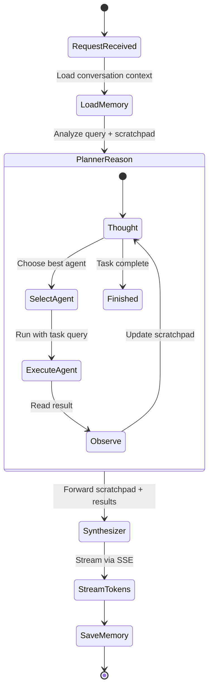
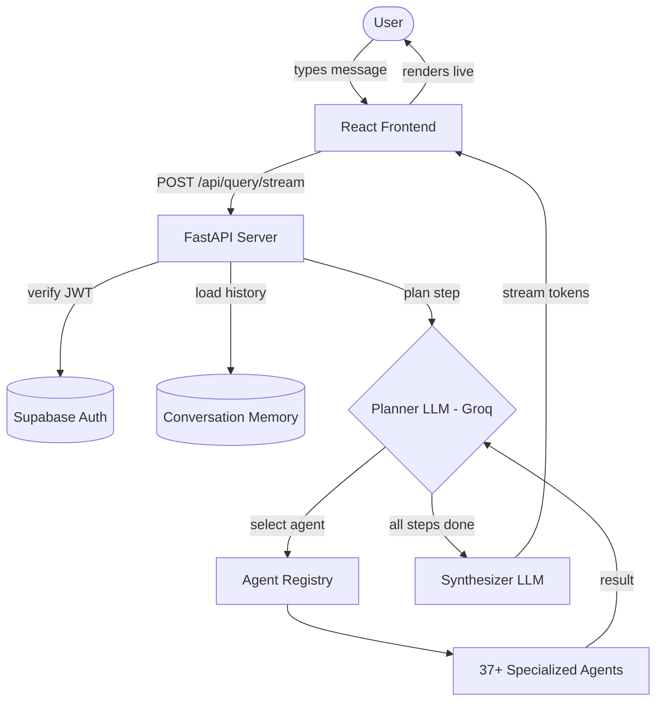

# 🤖 JARVIS — Autonomous Multi-Agent AI Operating System

<div align="center">

**Production-grade, multi-user AI platform powered by LangChain · Groq · FastAPI · React**

[](https://python.org)
[](https://fastapi.tiangolo.com)
[](https://react.dev)
[](https://langchain.com)
[](LICENSE)

</div>

---

JARVIS is a **production-grade autonomous AI system** that orchestrates 37+ specialized agents to handle complex, multi-step tasks across 12 industry domains — from live code execution in a cloud sandbox to RAG-powered document analysis, Gmail automation, financial intelligence, and EdTech lesson planning.

Unlike simple chatbot wrappers, JARVIS implements a **real ReAct agentic loop**: the Planner LLM reasons step-by-step, selects the most relevant agent from a self-describing registry, feeds its output forward as context, and repeats until the task is fully complete — then streams the final answer token-by-token to the user.

---

## ✨ What Makes This Different

| Feature | Details |
|---|---|
| **Real Agentic Loop** | Not a RAG wrapper. The Planner reasons, acts, observes, and re-plans iteratively using a persistent scratchpad (ReAct pattern) |
| **Streaming Responses** | `/api/query/stream` SSE endpoint streams `step_start → agent_result → synthesis_chunk` events. The UI renders tokens as they arrive — identical to ChatGPT |
| **Multi-Tier Code Sandbox** | Code runs in E2B Cloud → Local Docker → Host subprocess, auto-detected at runtime with graceful degradation |
| **37+ Specialized Agents** | Search, Code, RAG, Email, Calendar, SQL, Finance, Maps, EdTech, DevOps, SecOps, Legal, Healthcare, and more |
| **12 Industry Profiles** | Per-profile agent configurations load curated tool suites for developers, analysts, teachers, security engineers, etc. |
| **Multi-User Isolation** | Per-user FAISS indexes, SQLite databases, document stores, and profile configs via `contextvars` |
| **Self-Correcting Agents** | Code Agent and Database Agent detect errors (syntax errors, SQL exceptions, missing modules), self-heal, and retry |
| **Dynamic Agent Builder** | Meta-agent that writes, validates, and hot-registers new Python agents into the running system at runtime |
| **Google Workspace OAuth** | Full OAuth2 flow for Drive, Docs, Sheets, and Calendar — live gradebook creation, calendar scheduling, PDF export |
| **Hybrid RAG** | BM25 keyword + FAISS semantic search + Cohere reranking for production-grade document retrieval accuracy |

---

## 🏗️ System Architecture

```
┌──────────────────────────────────────────────┐
│         React 18 Frontend (Vite)             │
│  Token streaming · Agent cards · OAuth UI    │
└──────────────────┬───────────────────────────┘
                   │  POST /api/query/stream  (SSE)
                   │  POST /api/query         (REST)
                   ▼
┌──────────────────────────────────────────────┐
│         FastAPI Server (Uvicorn)             │
│  JWT Auth (Supabase) · File Upload · SSE     │
└──────────────────┬───────────────────────────┘
                   │
         ┌─────────┴─────────┐
         │                   │
         ▼                   ▼
┌──────────────┐   ┌─────────────────────┐
│ Conversation │   │    Orchestrator      │
│   Memory     │──►│  (ReAct Loop ×5)    │
└──────────────┘   └────────┬────────────┘
                            │
             ┌──────────────▼────────────────┐
             │         Planner LLM           │
             │  (Groq Llama-3.3-70B)        │
             │  Selects next agent + query   │
             └──────────────┬────────────────┘
                            │
             ┌──────────────▼────────────────────────────┐
             │          Agent Registry (37+ agents)       │
             │  🔍 Search · 💻 Code · 📊 RAG · 📧 Email  │
             │  🗄️ SQL · 💰 Finance · ☁️ DevOps · 🛡️ Sec │
             │  🎓 EdTech Suite (11 agents) · + more...   │
             └──────────────┬────────────────────────────┘
                            │
             ┌──────────────▼────────────────┐
             │       Synthesizer LLM         │
             │  Merges all agent outputs     │
             │  Streams tokens → SSE → UI    │
             └───────────────────────────────┘
```

### Streaming Event Flow (SSE)

```
POST /api/query/stream
        │
        ├── {"type": "step_start",      "agent": "search", "thought": "..."}
        ├── {"type": "agent_result",    "agent": "search", "result": "..."}
        ├── {"type": "step_start",      "agent": "code",   "thought": "..."}
        ├── {"type": "agent_result",    "agent": "code",   "result": "..."}
        ├── {"type": "synthesis_chunk", "chunk": "The "}
        ├── {"type": "synthesis_chunk", "chunk": "latest "}
        ├── {"type": "synthesis_chunk", "chunk": "AI news..."}
        ├── {"type": "done",            "agents_used": ["search", "code"]}
        └── {"type": "stream_end"}
```

### Multi-Tier Code Sandbox

```
E2B_API_KEY present?
      ✅ → Tier 1: E2B Cloud Sandbox   (isolated, remote VM, Python 3.13)
      ❌ → Docker daemon running?
               ✅ → Tier 2: Docker Container  (jarvis-sandbox image, local)
               ❌ → Tier 3: Host Subprocess  (fallback, warns user)
```

---

## ⚡ Key Features

### Core Engine
- **Sequential Agentic Loop (ReAct):** The Planner LLM iteratively reasons, selects agents, and re-plans using a persistent scratchpad — up to 5 steps per query
- **Real-Time SSE Streaming:** `/api/query/stream` pushes planning steps, agent results, and synthesis tokens as they happen. Frontend renders a live blinking cursor and step-pill badges
- **Conversation Memory:** Full multi-turn conversation history injected into every planner and agent call for context continuity
- **Self-Correction:** Code Agent detects `SyntaxError`, `NameError`, `ModuleNotFoundError` and self-heals. Database Agent handles missing tables / columns via `ALTER TABLE`

### Security & Isolation
- **Multi-Tier Sandbox:** E2B Cloud → Docker Container → Host subprocess fallback, auto-detected at startup
- **Per-User Data Isolation:** Every user gets isolated FAISS indexes, SQLite databases, file storage, and profile configs via `contextvars.ContextVar`
- **JWT Authentication:** Supabase JWT verified on every request. No shared state between users

### Integrations
- **Google Workspace OAuth2:** Drive, Docs, Sheets, Calendar — agents create live documents and schedule events in users' accounts
- **Gmail IMAP/SMTP:** Read inbox, fetch threads, and send emails programmatically
- **Tavily Web Search:** Real-time web search with structured results
- **yfinance:** Stock prices, historical charts, earnings data, cryptocurrency
- **Geopy + Folium:** Geolocation and interactive map rendering

### Extensibility
- **Self-Describing Registry:** Drop an agent file into `backend/agents/`, and the `__init__.py` auto-discovers and registers it. The Planner LLM immediately has access to it
- **Dynamic Agent Builder:** A meta-agent that writes, validates, imports, and hot-registers new Python agents at runtime — no restart required
- **YAML-Configurable Prompts:** Per-agent system prompts and domain expertise configurable in `backend/config/agent_expertise.yaml`
- **Webhook I/O:** Register incoming event hooks and broadcast agent execution updates via outgoing webhooks

---

## 🔌 Agent Registry (37+ Agents, 7 Industry Suites)

### Core Reasoning & File Systems
| Agent | Description |
|---|---|
| `search` | Real-time web search via Tavily API |
| `code` | Sandboxed Python execution (E2B→Docker→Host), file I/O, self-correction |
| `analyse` | Hybrid RAG: BM25 + FAISS + Cohere reranking, multimodal vision (Llama 4 Scout) |
| `summary` | Copywriting, contextual summarization, text formatting |

### Services & APIs
| Agent | Description |
|---|---|
| `email` | Gmail IMAP/SMTP — read threads, send messages |
| `calendar` | Google Calendar — create events, find free slots |
| `database` | NL-to-SQL → SQLite with schema self-healing |
| `scraper` | Clean HTML extraction, removing scripts/nav/styles |
| `maps` | Geolocation, routing, Folium interactive maps |

### Media & Extended Capabilities
| Agent | Description |
|---|---|
| `image_gen` | Text-to-image synthesis |
| `finance` | Stock/crypto data, charts, portfolio metrics via yfinance |
| `voice` | Speech-to-Text (STT) and Text-to-Speech (TTS) |
| `translation` | Multi-language translation |
| `video_to_mp3` | Audio extraction from video files |
| `visualization` | Matplotlib/Seaborn chart renderer, saved as images |

### Meta & Systems Control
| Agent | Description |
|---|---|
| `devops` | Process monitoring, Docker status, GitHub workflow audits |
| `package_manager` | Pip/npm installs inside the multi-tier sandbox |
| `notification` | Push SSE toast notifications to the client dashboard |
| `agent_builder` | Writes and hot-registers new Python agents at runtime |
| `analyst_team` | Sub-orchestrator that coordinates Analyst, Finance, and Visualizer agents |
| `dev_team` | Sub-orchestrator for Code + DevOps + Package Manager coordination |
| `ops_team` | Sub-orchestrator for Calendar + Email + Notification coordination |

### ☁️ Cloud & DevOps Suite
| Agent | Description |
|---|---|
| `cloud_infra` | Terraform IaC dry-runs, Kubernetes pod health, AWS cost auditing |
| `github_workflow` | PR summaries, CI/CD pipeline audits, issue triage |

### 📈 Finance & BI Suite
| Agent | Description |
|---|---|
| `market_intelligence` | Real-time fundamentals, crypto sentiment, trend analysis |
| `financial_reporting` | P&L statement generation, departmental expense auditing |

### 🛡️ Cybersecurity Suite
| Agent | Description |
|---|---|
| `sec_ops` | CVE dependency auditing, auth log inspection |
| `compliance` | SOC2, GDPR, ISO27001 compliance readiness checks |

### 🧬 Healthcare Suite
| Agent | Description |
|---|---|
| `biomedical_rag` | PubMed research indexing, clinical trial synthesis |

### 📣 Creative & Marketing Suite
| Agent | Description |
|---|---|
| `marketing_campaign` | SEO strategy, multi-platform ad copy, email sequences |
| `multimedia_processor` | Video storyboard scripts, media production outlines |

### ⚖️ Legal & HR Suite
| Agent | Description |
|---|---|
| `legal_contract` | Contract clause extraction, NDA risk rating |
| `talent_ops` | Resume skill parsing, technical interview rubrics |

### 🎓 EdTech Studio (11 Agents)
Full autonomous executive assistant for K-12 and university educators, with PDF export and live Google Workspace integration:

| Agent | Description |
|---|---|
| `ncert_lesson_architect` | NCERT/CBSE lesson plans → PDF + live Google Doc |
| `cbse_exam_generator` | Question papers with answer keys → PDF export |
| `hinglish_socratic_tutor` | Hinglish Socratic tutoring (step-by-step guidance) |
| `cce_report_card_architect` | CCE-format student report cards → Google Sheets |
| `teacher_executive_assistant` | Lesson summaries, parent emails, meeting agendas |
| `document_exam_scanner` | Multimodal OCR of uploaded exam PDFs (Llama 4 Scout) |
| `sheets_gradebook_agent` | Live Google Sheets gradebooks with auto-grading formulas |
| `calendar_scheduler_agent` | Academic milestones and PTM scheduling on Google Calendar |
| `notes_manager_agent` | Organize and search lecture notes and revision material |
| `whatsapp_notice_curator` | Parent broadcast messages for WhatsApp/SMS |

---

## 📁 Project Structure

```
JARVIS/
├── main.py                           # ASGI entrypoint (uvicorn main:app)
├── requirements.txt
├── .env                              # API keys (not committed)
│
├── backend/
│   ├── config.py                     # Central config: models, paths, 12 role profiles
│   ├── logger.py                     # Color-coded structured logger
│   │
│   ├── config/
│   │   └── agent_expertise.yaml      # Per-agent domain prompts (YAML-configurable)
│   │
│   ├── core/
│   │   ├── orchestrator.py           # ReAct loop controller (plan → execute → synthesize)
│   │   ├── planner.py                # LLM-based next-step routing
│   │   ├── synthesizer.py            # Merges agent outputs → final response (streaming)
│   │   ├── memory.py                 # Per-session conversation history
│   │   ├── registry.py               # Auto-discovering agent registry
│   │   ├── sandbox.py                # Multi-tier sandbox: E2B → Docker → Host
│   │   ├── analytics.py              # Token + cost tracking (LangChain callback)
│   │   ├── webhooks.py               # Incoming/outgoing event hooks
│   │   └── notifications.py          # SSE notification broadcaster
│   │
│   ├── agents/                       # 37+ modular agents (auto-registered)
│   │   ├── base.py
│   │   ├── search_agent.py
│   │   ├── code_agent.py             # E2B/Docker/Host sandbox execution
│   │   ├── analyse_agent.py          # Hybrid RAG + multimodal vision
│   │   ├── summary_agent.py
│   │   ├── email_agent.py
│   │   ├── calendar_agent.py
│   │   ├── database_agent.py
│   │   ├── scraper_agent.py
│   │   ├── finance_agent.py
│   │   ├── maps_agent.py
│   │   ├── visualization_agent.py
│   │   ├── image_gen_agent.py
│   │   ├── voice_agent.py
│   │   ├── translation_agent.py
│   │   ├── video_to_mp3_agent.py
│   │   ├── devops_agent.py
│   │   ├── package_manager_agent.py
│   │   ├── notification_agent.py
│   │   ├── agent_builder_agent.py
│   │   ├── cloud_infra_agent.py
│   │   ├── github_workflow_agent.py
│   │   ├── sec_ops_agent.py
│   │   ├── compliance_agent.py
│   │   ├── market_intelligence_agent.py
│   │   ├── financial_reporting_agent.py
│   │   ├── biomedical_rag_agent.py
│   │   ├── marketing_campaign_agent.py
│   │   ├── multimedia_processor_agent.py
│   │   ├── legal_contract_agent.py
│   │   ├── talent_ops_agent.py
│   │   ├── edtech_agent.py           # 11-agent EdTech suite
│   │   ├── analyst_team_agent.py
│   │   ├── dev_team_agent.py
│   │   ├── ops_team_agent.py
│   │   └── team_base.py
│   │
│   ├── tools/
│   │   └── document_loader.py        # PDF, DOCX, PPTX, image parser
│   │
│   ├── utils/
│   │   ├── pdf_generator.py
│   │   ├── google_sheets_service.py
│   │   └── google_workspace_service.py
│   │
│   └── api/
│       └── server.py                 # FastAPI: Auth, Upload, /api/query, /api/query/stream
│
├── data/                             # Runtime data (gitignored)
│   ├── documents/                    # Per-user uploaded files
│   ├── faiss_index/                  # Per-user vector indexes
│   ├── workspace/                    # Per-user sandbox workspace
│   ├── generated_images/
│   └── databases/                    # Per-user SQLite + profile configs
│
├── tests/
│   └── test_self_correction.py
│
└── frontend/
    ├── vite.config.js
    ├── package.json
    └── src/
        ├── App.jsx                   # SSE stream consumer, state management
        ├── index.css                 # Neon glassmorphism, streaming animations
        └── components/
            ├── Login.jsx             # Auth + 12-profile workspace selector
            ├── Header.jsx
            ├── Sidebar.jsx
            ├── ChatMessage.jsx       # Streaming cursor + step-pill badges
            ├── ChatInput.jsx
            ├── AgentsGrid.jsx
            ├── ArtifactsPanel.jsx
            ├── AgentBuilderPanel.jsx
            ├── DevPanel.jsx
            ├── IntegrationsModal.jsx
            ├── WorkspaceExplorer.jsx
            ├── TeacherStudioDashboard.jsx
            ├── ParticleBackground.jsx
            └── TypingIndicator.jsx
```

---

## 🛠️ Tech Stack

### Backend
| Layer | Technology |
|---|---|
| **Framework** | FastAPI (Python 3.10+), Uvicorn ASGI |
| **AI Orchestration** | LangChain 0.3+, LangChain-Core, LangChain-Community |
| **LLM Provider** | Groq (`llama-3.3-70b-versatile`, `meta-llama/llama-4-scout-17b-16e-instruct`) |
| **Vector DB** | FAISS (local per-user), ChromaDB |
| **Embeddings** | HuggingFace `all-MiniLM-L6-v2` |
| **Hybrid Search** | BM25 (`rank_bm25`) + Cohere Reranking |
| **Code Sandbox** | E2B Code Interpreter → Docker → Host subprocess |
| **Auth** | Supabase JWT verification |
| **Streaming** | Server-Sent Events (SSE) via `StreamingResponse` |

### Frontend
| Layer | Technology |
|---|---|
| **Framework** | React 18, Vite 5 |
| **Styling** | Vanilla CSS (glassmorphism, neon, streaming animations) |
| **Charts** | Recharts |
| **Auth** | Supabase JS client |
| **Streaming** | `ReadableStream` + `TextDecoder` SSE consumer |

### External APIs
| Service | Purpose |
|---|---|
| **Groq** | Primary LLM inference (all agents + planner + synthesizer) |
| **Tavily** | Real-time web search |
| **E2B Code Interpreter** | Remote cloud sandbox for Python execution |
| **Supabase** | User authentication and JWT verification |
| **Google OAuth2** | Drive, Docs, Sheets, Calendar integration |
| **Gmail IMAP/SMTP** | Email read/send |
| **yfinance** | Stock and cryptocurrency data |
| **Cohere** | RAG document reranking |
| **Geopy + Folium** | Geocoding and interactive maps |
| **Slack Webhooks** | Outgoing notification channel |

---

## 🚀 Setup & Installation

### 1. Clone the Repository
```bash
git clone https://github.com/yourusername/JARVIS.git
cd JARVIS
```

### 2. Configure Environment Variables
Create a `.env` file in the project root:

```env
# ── LLM (Required) ─────────────────────────────────────────────────
GROQ_API_KEY=your_groq_api_key

# ── Web Search (Required for Search Agent) ─────────────────────────
TAVILY_API_KEY=your_tavily_api_key

# ── Supabase Auth (Required) ────────────────────────────────────────
SUPABASE_URL=your_supabase_project_url
SUPABASE_ANON_KEY=your_supabase_anon_key

# ── Code Sandbox (Optional — falls back to Docker/Host) ────────────
E2B_API_KEY=your_e2b_api_key

# ── Email Agent ─────────────────────────────────────────────────────
GMAIL_EMAIL=your_gmail_address
GMAIL_APP_PASSWORD=your_gmail_app_password

# ── Google Workspace OAuth2 ─────────────────────────────────────────
GOOGLE_CLIENT_ID=your_google_client_id
GOOGLE_CLIENT_SECRET=your_google_client_secret

# ── RAG Reranking (Optional) ────────────────────────────────────────
COHERE_API_KEY=your_cohere_api_key

# ── Outgoing Notifications (Optional) ──────────────────────────────
SLACK_WEBHOOK_URL=your_slack_webhook_url
```

### 3. Install Backend Dependencies
```bash
python -m venv venv

# Windows
venv\Scripts\activate
# macOS/Linux
source venv/bin/activate

pip install -r requirements.txt
```

### 4. Install Frontend Dependencies
```bash
cd frontend
npm install
```

---

## 📡 Running Locally

### Start the Backend (FastAPI + SSE)
```bash
# From project root, with venv active:
uvicorn main:app --reload --port 8000
```

### Start the Frontend (Vite)
```bash
cd frontend
npm run dev
```

Open **http://localhost:5173** — sign in, pick a workspace profile, and start chatting.

---

## 🔐 Authentication & Multi-User Architecture

JARVIS uses **Supabase** for production-grade authentication:

1. User signs in via `Login.jsx` → Supabase JWT issued
2. Every API request sends `Authorization: Bearer <token>`
3. FastAPI verifies against Supabase `/auth/v1/user`
4. `contextvars.ContextVar` (`current_user_id`) scopes ALL data operations:
   - FAISS vector index path
   - SQLite database path
   - Uploaded documents directory
   - Sandbox workspace directory
   - Profile configuration JSON

**Zero data leakage between users.** Every storage path is `data/{resource}/{user_id}/...`.

---

## 🏢 Workspace Profiles (12 Industry Roles)

At login, users select a workspace profile that loads a curated agent suite:

| Profile | Key Agents Enabled |
|---|---|
| `developer` | `code`, `devops`, `package_manager`, `database`, `agent_builder`, `dev_team` |
| `analyst` | `analyse`, `visualization`, `finance`, `database`, `market_intelligence`, `analyst_team` |
| `designer` | `image_gen`, `visualization`, `translation`, `summary` |
| `manager` | `calendar`, `email`, `notification`, `database`, `ops_team` |
| `cloud_devops` | `cloud_infra`, `github_workflow`, `devops`, `code`, `sec_ops` |
| `financial_analyst` | `market_intelligence`, `financial_reporting`, `finance`, `analyse`, `visualization` |
| `cybersec_auditor` | `sec_ops`, `compliance`, `code`, `database`, `analyse` |
| `healthcare_researcher` | `biomedical_rag`, `analyse`, `translation`, `summary` |
| `creative_marketer` | `marketing_campaign`, `multimedia_processor`, `image_gen`, `search` |
| `legal_ops` | `legal_contract`, `talent_ops`, `analyse`, `summary` |
| `edtech_studio` | Full 11-agent EdTech suite + `search`, `analyse`, `calendar`, `sheets` |
| `guest` | `search`, `summary`, `translation` |

---

## 🧪 Testing

### Run Integration Tests
```bash
# Windows (PowerShell):
$env:PYTHONPATH="."; python tests/test_self_correction.py

# macOS/Linux:
PYTHONPATH=. python tests/test_self_correction.py
```

### Test Coverage
| Scenario | What's Validated |
|---|---|
| **Code Agent Self-Correction** | Recovers from `NameError` / `SyntaxError` by patching and re-executing |
| **Database Agent Self-Correction** | Handles missing tables via auto `CREATE TABLE`, missing columns via `ALTER TABLE` |
| **Module Installation Loop** | Orchestrator routes `ModuleNotFoundError` → `PackageManagerAgent` → retry execution |
| **Sandbox Tier Degradation** | E2B failure falls back to Docker, Docker failure falls back to host subprocess |

### Smoke Test the Sandbox
```bash
python -c "
from dotenv import load_dotenv; load_dotenv()
from backend.core.sandbox import ExecutionSandbox
sb = ExecutionSandbox('test')
print('Tier:', sb.get_tier_info())
print(sb.execute_python('print(1+1)'))
sb.cleanup()
"
```

---

## 🗺️ Architecture Diagrams

### ReAct Agentic Loop

```mermaid
stateDiagram-v2
    [*] --> RequestReceived
    RequestReceived --> LoadMemory : Load conversation context
    LoadMemory --> PlannerReason : Analyze query + scratchpad

    state PlannerReason {
        [*] --> Thought
        Thought --> SelectAgent : Choose best agent
        SelectAgent --> ExecuteAgent : Run with task query
        ExecuteAgent --> Observe : Read result
        Observe --> Thought : Update scratchpad
        Thought --> Finished : Task complete
    }

    PlannerReason --> Synthesizer : Forward scratchpad + results
    Synthesizer --> StreamTokens : Stream via SSE
    StreamTokens --> SaveMemory
    SaveMemory --> [*]
```

### Component Data Flow

```mermaid
graph TD
    User([User]) -->|types message| React[React Frontend]
    React -->|POST /api/query/stream| Server[FastAPI Server]
    Server -->|verify JWT| Supabase[(Supabase Auth)]
    Server -->|load history| Memory[(Conversation Memory)]
    Server -->|plan step| Planner{Planner LLM - Groq}
    Planner -->|select agent| Registry[Agent Registry]
    Registry --> Agents[37+ Specialized Agents]
    Agents -->|result| Planner
    Planner -->|all steps done| Synthesizer[Synthesizer LLM]
    Synthesizer -->|stream tokens| React
    React -->|renders live| User
```

---

## 🎯 How to Interview With This Project

This section gives you **ready-to-use talking points** for every major technical area of JARVIS. Use these when recruiters or interviewers ask *"tell me about a project you built."*

---

### 💬 Opening Pitch (30-second version)

> *"I built JARVIS — a production-grade autonomous AI operating system. It's not a chatbot wrapper. It uses a real ReAct agentic loop where a Planner LLM reasons step-by-step, dynamically selects from 37+ specialized agents, and streams the final answer token-by-token to the user via Server-Sent Events — the same way ChatGPT works. It has multi-user auth, a 3-tier sandboxed code execution engine, hybrid RAG, and 12 industry workspace profiles."*

---

### 🧠 1. ReAct Agentic Loop — "How does the AI actually think?"

**What to say:**
> *"The core is a ReAct loop — Reasoning + Acting. The Planner LLM receives the user's query, the conversation history, and a persistent scratchpad. It picks the most relevant agent, runs it, observes the result, updates the scratchpad, and repeats — up to 5 steps. Only then does the Synthesizer LLM stream the final human-readable response. This is fundamentally different from a single LLM call — it's autonomous multi-step problem solving."*

**Technical depth to add if asked:**
- The Planner runs on `groq/llama-3.3-70b-versatile` — chosen for its 128k context window to hold the full scratchpad
- Each step emits an SSE `step_start` event before executing, so the frontend shows "Running search..." in real time
- The scratchpad is a formatted string of all `Thought → Action → Observation` triples, injected as context into the next planner call

---

### ⚡ 2. SSE Streaming — "How did you implement real-time streaming like ChatGPT?"

**What to say:**
> *"I built a `POST /api/query/stream` endpoint using FastAPI's `StreamingResponse` with `text/event-stream` content type. The orchestrator pipeline runs in a background thread, pushing structured JSON events — `step_start`, `agent_result`, `synthesis_chunk`, `done` — into a `queue.Queue`. The main async thread reads from the queue and yields each line. On the frontend, I use the browser's native `ReadableStream` API with a `TextDecoder` to consume events and update the message bubble in place, character by character."*

**Technical depth to add if asked:**
- This avoids the entire dependency on WebSockets — SSE is simpler, unidirectional, and HTTP/1.1 compatible
- The `synthesis_chunk` events come from LangChain's `(prompt | llm).stream()` — each `AIMessageChunk` is a separate queue event
- The frontend sets `msg.isStreaming = true` on the in-progress bubble, triggering a blinking cyan cursor CSS animation via `@keyframes stream-blink`

---

### 🐳 3. Multi-Tier Sandbox — "How do you safely execute untrusted code?"

**What to say:**
> *"I built an `ExecutionSandbox` class that auto-detects the best available execution environment at startup. Tier 1 is E2B Cloud — a remote Python 3.13 VM that's completely isolated from the host. If the API key isn't set, it falls back to Tier 2: a local Docker container with a volume-mounted workspace. If Docker isn't running, Tier 3 is a host subprocess with a warning banner injected into the output. Every code execution goes through this class — so users always get the safest environment available."*

**Technical depth to add if asked:**
- The `ExecutionSandbox` exposes a unified API: `execute_python()`, `execute_command()`, `write_file()`, `read_file()` — regardless of tier
- Self-correction: if the Code Agent gets a `NameError` or `SyntaxError`, it analyzes the traceback, patches the code, and re-runs automatically — before returning to the user
- `ModuleNotFoundError` triggers a cross-agent correction: the Orchestrator routes to `PackageManagerAgent` to `pip install` the missing package, then resumes execution

---

### 🔍 4. Hybrid RAG — "How does your document analysis work?"

**What to say:**
> *"The Analyse Agent uses hybrid retrieval — not just FAISS semantic search. I combine BM25 keyword search with FAISS vector search, merge and deduplicate the candidates, then run them through Cohere's reranking API. This gives much better recall for domain-specific technical queries where semantic search alone misses exact terms. For image documents, I use Llama 4 Scout — a multimodal vision LLM — to extract captions and analysis before indexing."*

**Technical depth to add if asked:**
- Each user has a completely isolated FAISS index at `data/faiss_index/{user_id}/` — no cross-user data leakage
- Embeddings use `sentence-transformers/all-MiniLM-L6-v2` — lightweight and fast, runs locally with no API cost
- Documents are chunked with a `RecursiveCharacterTextSplitter` (512 tokens, 50 overlap) and indexed on upload — the RAG pipeline is always fresh

---

### 🔐 5. Multi-User Auth & Isolation — "How do you handle multiple users?"

**What to say:**
> *"Every API request sends a Supabase JWT. FastAPI verifies it against the Supabase `/auth/v1/user` endpoint on every single request. Once verified, I set a `contextvars.ContextVar` called `current_user_id` to the user's UUID. Every downstream function — FAISS index path, SQLite database, document directory, sandbox workspace — calls `current_user_id.get()` to resolve its path. So two users running simultaneous requests never touch the same files."*

**Technical depth to add if asked:**
- `contextvars.ContextVar` is the correct tool for async request scoping in Python — it's like thread-locals but works correctly across `async/await` and `asyncio` task boundaries
- The profile config (`developer`, `analyst`, `edtech_studio`, etc.) is stored per-user as a JSON file and loaded at request time to filter the agent pool — so a Guest user can't accidentally invoke the Agent Builder

---

### 🤖 6. Self-Describing Agent Registry — "How do you add new agents?"

**What to say:**
> *"The agent registry uses Python's `importlib` to auto-discover every file in `backend/agents/` at startup. Each agent class defines a `name` and `description` string. The Planner LLM reads all descriptions dynamically — so when I drop a new agent file in that folder, the planner immediately knows it exists and can use it. I even built a meta-agent called `agent_builder_agent` that writes new agent Python files, validates the syntax, imports them with `importlib`, and registers them into the live running system — no restart required."*

**Technical depth to add if asked:**
- Each agent extends `BaseAgent` with a single `run(query: str) -> str` method — the contract is dead simple
- Agent descriptions are injected into the Planner's system prompt as a formatted tool list — similar to OpenAI function calling but fully custom
- The Agent Builder agent asks for user confirmation via a `needs_confirmation` SSE event before writing any files — so it can't create agents autonomously without human approval

---

### 🏢 7. Industry Profiles — "Why 12 workspace profiles?"

**What to say:**
> *"The planner's accuracy improves significantly when the agent pool is smaller. A cybersecurity auditor doesn't need the EdTech lesson planner — giving the planner 8 relevant agents vs 37 total agents makes it pick the right tool faster and more reliably. Each profile also loads a curated UI: custom welcome chips, a dedicated subtitle, and role-specific suggestions. The EdTech profile even gets its own full React dashboard — `TeacherStudioDashboard.jsx` — instead of the standard chat interface."*

---

### 📊 8. Questions Interviewers Commonly Ask — and your answers

| Question | Your Answer |
|---|---|
| **"What was the hardest part to build?"** | *"The multi-tier sandbox fallback. Getting the Docker container to mount the right per-user workspace volume, auto-build the image if missing, and expose a unified API identical to E2B — while gracefully degrading — took careful abstraction design."* |
| **"How does it compare to LangGraph or CrewAI?"** | *"JARVIS implements a custom ReAct loop from scratch rather than using a framework's graph abstraction — which gives me full control over the scratchpad format, SSE event timing, and per-step error handling. LangGraph is powerful but adds significant complexity for what I needed."* |
| **"How would you scale this to production?"** | *"Replace SQLite with PostgreSQL via Supabase, replace local FAISS with a managed vector DB like Pinecone or pgvector, containerize the backend with Docker Compose, add a Redis queue for the SSE event bus instead of `queue.Queue`, and put a load balancer in front of multiple Uvicorn workers."* |
| **"How do you prevent prompt injection?"** | *"The agent descriptions are injected as a read-only system message — user input never touches the agent tool list. The sandbox runs code in an isolated VM so even if the planner were manipulated to run malicious code, it can't access the host."* |
| **"What would you do differently?"** | *"I'd add async execution for agents that can run in parallel — right now it's fully sequential. For queries like 'search X and search Y simultaneously', two search agents could run concurrently and shave 2-3 seconds off the response time."* |

---

## 📜 License

MIT License — see [LICENSE](LICENSE) for details.

---

<div align="center">

Built with **LangChain** · **Groq** · **FastAPI** · **React** · **Supabase** · **E2B**

⭐ *Star this repo if it helped you land a job in AI/ML engineering*

</div>
