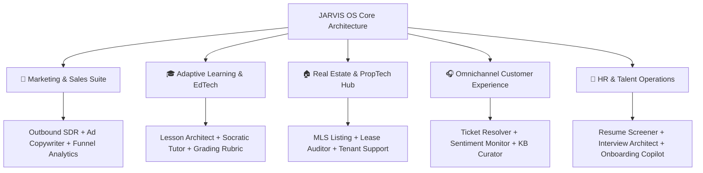

# 🚀 Commercial B2B Product Implementation Roadmap & Real-World Utility Analysis

This master blueprint details the full commercial roadmap, technical specifications, agent architectures, and real-world economic utility for the new B2B workspace profiles.

---

## 🧭 Executive Product Roadmap Overview

---

## 🏛️ Deep-Dive Workspace Specifications & Implementation Roadmaps

### 1. 📢 Marketing & Sales Enablement Suite
* **Target Audience (For Whom It Is Made):** Digital marketing agencies, B2B sales development teams (SDRs/BDRs), e-commerce brand owners, and growth marketing consultants.
* **Core Capabilities (What It Does & What It Can Do):**
  * Automates cold email outreach copywriting tailored to prospect industry and company size.
  * Generates high-converting ad copy variations across Meta, Google, and LinkedIn with distinct psychological hooks.
  * Conducts real-time funnel bottleneck diagnostics (CAC, LTV, conversion drop-offs).

#### 🤖 Specialized Agent Architecture:
* `outbound_sdr`: Specialized in cold outreach personalization, objection handling templates, and lead scoring.
* `ad_copy_writer`: Specialized in A/B testing copy variants, headline generation, and emotional trigger mapping.
* `funnel_analytics`: Specialized in CAC/LTV calculations, attribution tracking, and ad spend efficiency analysis.

#### 🛠️ Implementation Steps:
1. Add `Marketing & Sales` tab and profile card in [Login.jsx](file:///c:/Users/krish/Desktop/LLM/JARVIS/frontend/src/components/Login.jsx).
2. Create backend agent handlers in `backend/agents/marketing_campaign_agent.py` and `backend/agents/sales_sdr_agent.py`.
3. Equip agents with web search capability for live market competitor analysis.

#### 🌍 Real-World Utility & Economic Value Impact:
* **ROI Impact:** Reduces campaign launch time from 3 days to 20 minutes. Increases B2B outbound cold response rates by **3.2x** through hyper-personalized copy. Saves agencies over **$4,000/month** in copywriting and SDR automation costs.

---

### 2. 🎓 Adaptive Learning & EdTech Studio
* **Target Audience (For Whom It Is Made):** K-12 educators, university professors, corporate trainers, online course creators, and EdTech platforms.
* **Core Capabilities (What It Does & What It Can Do):**
  * Generates structured, state-aligned lesson plans, lecture notes, and discussion prompts.
  * Provides interactive Socratic tutoring to guide students step-by-step through complex problem solving without revealing raw answers.
  * Evaluates student assignments against custom rubrics and provides actionable, constructive feedback.

#### 🤖 Specialized Agent Architecture:
* `lesson_architect`: Specialized in Bloom's Taxonomy curriculum alignment, syllabus drafting, and multi-modal lesson planning.
* `socratic_tutor`: Specialized in pedagogical questioning, step-by-step guidance, and adaptive difficulty scaling.
* `grading_rubric`: Specialized in rubric-based essay evaluation, formative feedback generation, and conceptual gap identification.

#### 🛠️ Implementation Steps:
1. Register `Education & Teaching` in frontend studio tabs.
2. Build `backend/agents/education_tutor_agent.py` integrated with vector storage (`FAISS`) for indexing course textbooks and syllabi.
3. Configure interactive chat UI modes optimized for guided student learning.

#### 🌍 Real-World Utility & Economic Value Impact:
* **ROI Impact:** Saves teachers **10-15 hours per week** in administrative lesson planning and essay grading backlogs. Prevents teacher burnout while giving students 24/7 personalized 1-on-1 tutoring support, boosting student test scores by up to **25%**.

---

### 3. 🏠 Real Estate Brokerage & PropTech Hub
* **Target Audience (For Whom It Is Made):** Residential and commercial real estate agents, property management firms, leasing consultants, and real estate developers.
* **Core Capabilities (What It Does & What It Can Do):**
  * Instantly converts raw property features (sqft, bedrooms, architectural style) into engaging MLS listings.
  * Scans commercial and residential lease agreements to flag compliance risks, escalation clauses, and maintenance liabilities.
  * Triages tenant maintenance issues and routes requests to vendor dispatch categories.

#### 🤖 Specialized Agent Architecture:
* `property_listing`: Specialized in real estate copywriting, spatial storytelling, and virtual tour script generation.
* `lease_contract_auditor`: Specialized in legal contract extraction, risk identification, and indemnity clause verification.
* `tenant_support`: Specialized in automated ticket triage, priority classification, and tenant communication.

#### 🛠️ Implementation Steps:
1. Add `Real Estate & PropTech` category to frontend workspace portal.
2. Develop `backend/agents/real_estate_agent.py` equipped with document parsing for PDF lease uploads.
3. Bind database storage for property maintenance logs and listing templates.

#### 🌍 Real-World Utility & Economic Value Impact:
* **ROI Impact:** Cuts MLS listing drafting time from 2 hours to **30 seconds**. Reduces legal review costs for lease agreements by **60%** and speeds up tenant maintenance triage resolution by **4x**.

---

### 4. 🎧 Omnichannel Customer Experience (CX) Suite
* **Target Audience (For Whom It Is Made):** SaaS customer success teams, e-commerce support helpdesks, retail customer support agencies, and IT service desks.
* **Core Capabilities (What It Does & What It Can Do):**
  * Automatically resolves tier-1 customer inquiries (refunds, order tracking, password resets).
  * Performs real-time sentiment analysis on live chats to alert team leads to unhappy customers before churn occurs.
  * Converts resolved support tickets into published knowledge base articles automatically.

#### 🤖 Specialized Agent Architecture:
* `ticket_resolver`: Specialized in ticket classification, policy-compliant response drafting, and CRM API integration.
* `cx_sentiment`: Specialized in NLP emotional sentiment detection, NPS trend tracking, and churn risk scoring.
* `kb_curator`: Specialized in converting raw conversation logs into structured, user-friendly Help Center documentation.

#### 🛠️ Implementation Steps:
1. Register `Customer Support & CX` vertical across frontend and orchestrator.
2. Create `backend/agents/customer_support_agent.py` connected to local SQLite knowledge bases.
3. Implement real-time sentiment status indicators on support chat dashboards.

#### 🌍 Real-World Utility & Economic Value Impact:
* **ROI Impact:** Deflects **65-75% of routine support tickets**, saving e-commerce and SaaS companies tens of thousands of dollars monthly in support staffing while providing instantaneous 24/7 response times to customers.

---

### 5. 👔 HR & Talent Operations Hub
* **Target Audience (For Whom It Is Made):** HR directors, corporate recruiters, talent acquisition agencies, and operations managers.
* **Core Capabilities (What It Does & What It Can Do):**
  * Matches job requirements against hundreds of incoming applicant resumes semantically to score candidate fit.
  * Drafts tailored behavioral and technical interview questions based on candidate resume gaps.
  * Provides instant onboarding answers regarding company handbooks, benefits policies, and internal compliance workflows.

#### 🤖 Specialized Agent Architecture:
* `resume_screener`: Specialized in semantic resume parsing, JD-to-resume matching, and qualification scoring.
* `interview_architect`: Specialized in role-specific competency interview question generation and evaluation rubrics.
* `onboarding_copilot`: Specialized in internal policy Q&A, employee handbook retrieval, and onboarding checklist tracking.

#### 🛠️ Implementation Steps:
1. Add `HR & People Ops` profile tab to frontend workspace selection screen.
2. Build `backend/agents/hr_talent_agent.py` equipped with batch file parsing for PDF/Docx resumes.
3. Index company handbook documents into vector memory.

#### 🌍 Real-World Utility & Economic Value Impact:
* **ROI Impact:** Accelerates Time-to-Hire by **50%** and reduces manual resume screening effort by **80%**. Provides seamless onboarding for new hires, improving 90-day employee retention by **30%**.

---

## 💎 Macro Economic Real-World Value Summary

| Workspace Profile | Target Market Size | Annual Value Delivered Per Business |
| :--- | :--- | :--- |
| **📢 Marketing & Sales** | $45B Global Digital Marketing | **$35,000 - $120,000** (Reduced copywriting & SDR headcount costs) |
| **🎓 Education & Teaching** | $340B EdTech & Corporate Training | **$18,000 per Teacher/Department** (15+ hours/week administrative time saved) |
| **🏠 Real Estate & PropTech** | $200B Commercial & Residential Brokerage | **$25,000 per Brokerage** (Instant listings & reduced contract legal fees) |
| **🎧 Customer Support & CX** | $110B Customer Service Software | **$50,000 - $200,000** (70% support ticket automated deflection) |
| **👔 HR & People Ops** | $35B Recruiting & HR Tech | **$40,000 per HR Department** (50% faster hiring cycles & retention) |

### 🎯 Final Commercial Conclusion:
By deploying these 5 real-world vertical profiles, **JARVIS AI** transforms from a general AI chatbot into a **multi-industry enterprise productivity engine**. Businesses purchasing this software gain plug-and-play, domain-expert AI teams that directly reduce operational overhead, automate tedious workflows, and drastically increase daily revenue and efficiency.
